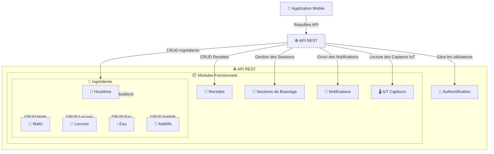

# 🌐 **Conception de l’API - Brasse-Bouillon**

## **📌 1️⃣ Introduction**

L’API REST de **Brasse-Bouillon** est conçue pour **faciliter l’interaction entre le frontend (React Native) et le backend (Node.js + Express)**, tout en assurant **sécurité, performance et évolutivité**.

📌 **Principales caractéristiques :**
✅ **Architecture RESTful** pour une communication standardisée.
✅ **Sécurisation via JWT et OAuth 2.0**.
✅ **Optimisation des requêtes avec `Redis` et `Sequelize`**.
✅ **Support des WebSockets/MQTT** pour l’interaction avec les capteurs IoT.

---

## **📌 2️⃣ Structure Générale de l’API**

📌 **L’API est composée des modules suivants :**
1️⃣ **Authentification et Utilisateurs (`/auth`)**
2️⃣ **Gestion des Recettes (`/recipes`)**
3️⃣ **Gestion des Ingrédients (`/ingredients`)**

- **Houblons (`/hops`)**
- **Malts (`/malts`)**
- **Levures (`/yeasts`)**
- **Eau (`/water`)**
- **Additifs (`/additives`)**
4️⃣ **Suivi des Sessions de Brassage (`/sessions`)**
5️⃣ **Notifications (`/notifications`)**
6️⃣ **Données IoT (`/iot`)**

📌 **Diagramme d’architecture de l’API :**



---

## **📌 3️⃣ Documentation des Endpoints**

📌 **Liste des principaux endpoints :**

| 🌐 **Endpoint** | 🔍 **Description** | 🔐 **Authentification** |
|---------------|------------------|------------------|
| **GET `/recipes`** | Liste des recettes | ❌ |
| **POST `/recipes`** | Création d’une recette | ✅ |
| **GET `/hops`** | Liste des houblons disponibles | ❌ |
| **POST `/hops`** | Ajouter un nouveau houblon | ✅ (Admin) |
| **GET `/hops/:id`** | Détails d’un houblon spécifique | ❌ |
| **PUT `/hops/:id`** | Modifier un houblon existant | ✅ (Admin) |
| **DELETE `/hops/:id`** | Supprimer un houblon | ✅ (Admin) |
| **GET `/malts`** | Liste des malts disponibles | ❌ |
| **POST `/malts`** | Ajouter un nouveau malt | ✅ (Admin) |
| **GET `/malts/:id`** | Détails d’un malt spécifique | ❌ |
| **PUT `/malts/:id`** | Modifier un malt existant | ✅ (Admin) |
| **DELETE `/malts/:id`** | Supprimer un malt | ✅ (Admin) |
| **GET `/yeasts`** | Liste des levures disponibles | ❌ |
| **POST `/yeasts`** | Ajouter une nouvelle levure | ✅ (Admin) |
| **GET `/yeasts/:id`** | Détails d’une levure spécifique | ❌ |
| **PUT `/yeasts/:id`** | Modifier une levure existante | ✅ (Admin) |
| **DELETE `/yeasts/:id`** | Supprimer une levure | ✅ (Admin) |
| **GET `/water`** | Liste des types d’eau disponibles | ❌ |
| **POST `/water`** | Ajouter une nouvelle eau | ✅ (Admin) |
| **GET `/water/:id`** | Détails d’un type d’eau spécifique | ❌ |
| **PUT `/water/:id`** | Modifier un type d’eau existant | ✅ (Admin) |
| **DELETE `/water/:id`** | Supprimer un type d’eau | ✅ (Admin) |
| **GET `/additives`** | Liste des additifs disponibles | ❌ |
| **POST `/additives`** | Ajouter un nouvel additif | ✅ (Admin) |
| **GET `/additives/:id`** | Détails d’un additif spécifique | ❌ |
| **PUT `/additives/:id`** | Modifier un additif existant | ✅ (Admin) |
| **DELETE `/additives/:id`** | Supprimer un additif | ✅ (Admin) |
| **POST `/malts`** | Ajouter un nouveau malt | ✅ (Admin) |
| **GET `/malts/:id`** | Détails d’un malt spécifique | ❌ |
| **PUT `/malts/:id`** | Modifier un malt existant | ✅ (Admin) |
| **DELETE `/malts/:id`** | Supprimer un malt | ✅ (Admin) |

---

## **📌 4️⃣ Sécurisation de l’API**

📌 **Mécanismes de sécurité mis en place :**
✅ **Authentification via JWT** pour sécuriser les accès API.
✅ **Protection contre les attaques CSRF et XSS** avec `helmet`.
✅ **Rate Limiting** pour éviter les abus (`express-rate-limit`).

📌 **Middleware d’authentification JWT :**

```javascript
const checkAdmin = (req, res, next) => {
    if (!req.user || req.user.role !== "admin") {
        return res.status(403).json({ message: "Accès interdit" });
    }
    next();
};
```

---

## **📌 5️⃣ Gestion des Performances**

📌 **Optimisation des requêtes API :**
✅ **Caching avec Redis** pour limiter les appels répétitifs à la base de données.
✅ **Pagination pour éviter les charges excessives sur les endpoints.**
✅ **Utilisation de `PM2` et `NGINX` pour la scalabilité.**

📌 **Exemple de mise en cache avec Redis :**

```javascript
const redis = require("redis");
const client = redis.createClient();

const cacheIngredients = (req, res, next) => {
    const key = req.originalUrl;
    client.get(key, (err, data) => {
        if (data) {
            return res.json(JSON.parse(data));
        }
        next();
    });
};

app.get("/hops", cacheIngredients, async (req, res) => {
    const hops = await Hop.findAll();
    client.setex(req.originalUrl, 3600, JSON.stringify(hops)); // Cache pour 1h
    res.json(hops);
});
```
