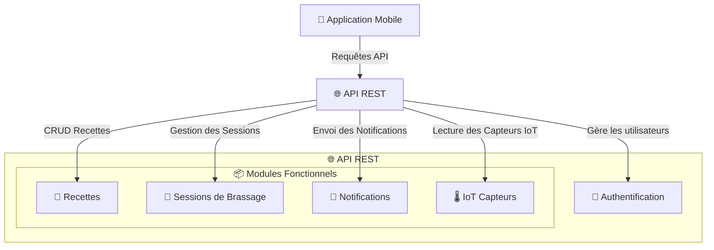

# 🌐 **Conception de l’API - Brasse-Bouillon**  

## **📌 1️⃣ Introduction**  

L’API REST de **Brasse-Bouillon** est conçue pour **faciliter l’interaction entre le frontend (React Native) et le backend (Node.js + Express)**, tout en assurant **sécurité, performance et évolutivité**.  

📌 **Principales caractéristiques :**  
✅ **Architecture RESTful** pour une communication standardisée.  
✅ **Sécurisation via JWT et OAuth 2.0**.  
✅ **Optimisation des requêtes avec `Redis` et `Sequelize`**.  
✅ **Support des WebSockets/MQTT** pour l’interaction avec les capteurs IoT.  

---

## **📌 2️⃣ Structure Générale de l’API**  

📌 **L’API est composée des modules suivants :**  
1️⃣ **Authentification et Utilisateurs (`/auth`)**  
2️⃣ **Gestion des Recettes (`/recipes`)**  
3️⃣ **Suivi des Sessions de Brassage (`/sessions`)**  
4️⃣ **Notifications (`/notifications`)**  
5️⃣ **Données IoT (`/iot`)**  

📌 **Diagramme d’architecture de l’API :**  



---

## **📌 3️⃣ Documentation des Endpoints**  

📌 **Liste des principaux endpoints :**  

| 🌐 **Endpoint** | 🔍 **Description** | 🔐 **Authentification** |
|---------------|------------------|------------------|
| **POST `/auth/login`** | Connexion utilisateur | ❌ |
| **POST `/auth/register`** | Création d’un compte utilisateur | ❌ |
| **GET `/recipes`** | Liste des recettes | ❌ |
| **POST `/recipes`** | Création d’une recette | ✅ |
| **GET `/sessions`** | Liste des sessions actives | ✅ |
| **POST `/sessions`** | Lancer une session | ✅ |
| **GET `/iot/sensors/:sessionId`** | Données capteurs | ✅ |

📌 **Réponse d’exemple :**  

```json
{
  "sessionId": 1,
  "temperature": 20.5,
  "gravity": 1.045,
  "recordedAt": "2024-02-15T14:30:00Z"
}
```

---

## **📌 4️⃣ Sécurisation de l’API**  

📌 **Mécanismes de sécurité mis en place :**  
✅ **Authentification via JWT** pour sécuriser les accès API.  
✅ **Protection contre les attaques CSRF et XSS** avec `helmet`.  
✅ **Rate Limiting** pour éviter les abus (`express-rate-limit`).  

📌 **Middleware d’authentification JWT :**  

```javascript
const jwt = require("jsonwebtoken");

const verifyToken = (req, res, next) => {
    const token = req.headers.authorization?.split(" ")[1];
    if (!token) return res.status(401).json({ message: "Accès refusé" });

    try {
        const decoded = jwt.verify(token, process.env.JWT_SECRET);
        req.user = decoded;
        next();
    } catch (err) {
        res.status(403).json({ message: "Token invalide" });
    }
};
```

---

## **📌 5️⃣ Gestion des Performances**  

📌 **Stratégies pour garantir une API performante :**  
✅ **Caching avec Redis** pour limiter les appels répétitifs à la base de données.  
✅ **Pagination pour éviter les charges excessives sur les endpoints.**  
✅ **Utilisation de `PM2` et `NGINX` pour la scalabilité.**  

📌 **Exemple de mise en cache avec Redis :**  

```javascript
const redis = require("redis");
const client = redis.createClient();

const cacheMiddleware = (req, res, next) => {
    const key = req.originalUrl;
    client.get(key, (err, data) => {
        if (data) {
            return res.json(JSON.parse(data));
        }
        next();
    });
};

app.get("/recipes", cacheMiddleware, async (req, res) => {
    const recipes = await Recipe.findAll();
    client.setex(req.originalUrl, 3600, JSON.stringify(recipes)); // Cache pour 1h
    res.json(recipes);
});
```

---

## **📌 6️⃣ Intégration avec les Capteurs IoT**  

📌 **Les capteurs IoT transmettent des données en temps réel via MQTT/WebSockets.**  

📌 **Exemple de gestion MQTT :**  

```javascript
const mqtt = require("mqtt");
const client = mqtt.connect("mqtt://broker.hivemq.com");

client.on("connect", () => {
    client.subscribe("brasse-bouillon/sensors");
});

client.on("message", (topic, message) => {
    const data = JSON.parse(message.toString());
    console.log("Données IoT reçues :", data);
});
```

📌 **Exemple de message MQTT reçu :**  

```json
{
  "sessionId": 1,
  "temperature": 21.0,
  "gravity": 1.040,
  "pressure": 1.3
}
```

