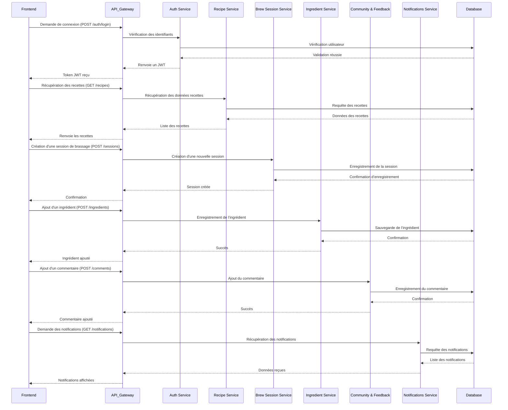

# Documentation des Interactions API - Brasse-Bouillon

## 1. Introduction

Cette documentation détaille les interactions entre le frontend et le backend via les endpoints de l'API REST de l'application **Brasse-Bouillon**.

---

## 2. Vue d’Ensemble des Flux API

L’API est conçue pour gérer les fonctionnalités suivantes :

| Fonctionnalité | Description | Endpoints |
|---------------|------------|-----------|
| **Authentification** | Gestion des utilisateurs et de l'accès sécurisé | `POST /auth/login`, `POST /auth/register`, `POST /auth/logout`, `GET /auth/me` |
| **Gestion des Recettes** | Création, modification, suppression et consultation des recettes | `GET /recipes`, `POST /recipes`, `PUT /recipes/{id}`, `DELETE /recipes/{id}` |
| **Gestion des Sessions de Brassage** | Suivi des sessions et journalisation | `GET /sessions`, `POST /sessions`, `PUT /sessions/{id}`, `DELETE /sessions/{id}` |
| **Gestion des Ingrédients** | Ajout et suivi des ingrédients | `GET /ingredients`, `POST /ingredients`, `PUT /ingredients/{id}`, `DELETE /ingredients/{id}` |
| **Commentaires et Notations** | Feedback des utilisateurs sur les recettes | `GET /comments/{recipe_id}`, `POST /comments`, `DELETE /comments/{id}` |
| **Notifications** | Envoi de rappels et d'alertes aux utilisateurs | `GET /notifications`, `POST /notifications`, `DELETE /notifications/{id}` |

---

## 3. Détails des Flux API

### 3.1 Flux d’Authentification

📌 **Objectif** : Gérer l’accès des utilisateurs à l’application.

- **Connexion** (`POST /auth/login`) → Retourne un token JWT.
- **Inscription** (`POST /auth/register`) → Crée un nouvel utilisateur.
- **Déconnexion** (`POST /auth/logout`) → Révoque le token JWT.
- **Vérification de session** (`GET /auth/me`) → Renvoie les infos de l’utilisateur connecté.

### 3.2 Flux de Gestion des Recettes

📌 **Objectif** : Permettre aux utilisateurs de gérer leurs recettes.

- **Récupérer toutes les recettes** (`GET /recipes`)
- **Créer une recette** (`POST /recipes`)
- **Modifier une recette** (`PUT /recipes/{id}`)
- **Supprimer une recette** (`DELETE /recipes/{id}`)

### 3.3 Flux de Gestion des Sessions de Brassage

📌 **Objectif** : Suivi des sessions de brassage.

- **Lister les sessions** (`GET /sessions`)
- **Créer une session** (`POST /sessions`)
- **Mettre à jour une session** (`PUT /sessions/{id}`)
- **Supprimer une session** (`DELETE /sessions/{id}`)

### 3.4 Flux de Gestion des Ingrédients

📌 **Objectif** : Gérer les ingrédients utilisés dans les recettes.

- **Lister les ingrédients** (`GET /ingredients`)
- **Ajouter un ingrédient** (`POST /ingredients`)
- **Modifier un ingrédient** (`PUT /ingredients/{id}`)
- **Supprimer un ingrédient** (`DELETE /ingredients/{id}`)

### 3.5 Flux de Gestion des Commentaires et Notations

📌 **Objectif** : Permettre l'interaction entre utilisateurs.

- **Voir les commentaires d’une recette** (`GET /comments/{recipe_id}`)
- **Ajouter un commentaire** (`POST /comments`)
- **Supprimer un commentaire** (`DELETE /comments/{id}`)

### 3.6 Flux des Notifications

📌 **Objectif** : Envoyer des alertes et rappels aux utilisateurs.

- **Voir les notifications** (`GET /notifications`)
- **Créer une notification** (`POST /notifications`)
- **Supprimer une notification** (`DELETE /notifications/{id}`)

---

## 4. Schéma des Interactions API



Chaque module communique via **des appels REST sécurisés avec JWT**.

## **📌 5. Exemples de Requêtes et Réponses JSON**

### **1️⃣ Authentification**

#### **🔹 Connexion d’un utilisateur**

##### **Requête (POST /auth/login)**

```json
{
  "email": "user@example.com",
  "password": "securepassword123"
}
```

##### **Réponse (200 - Succès)**

```json
{
  "token": "eyJhbGciOiJIUzI1...",
  "user": {
    "id": 1,
    "name": "John Doe",
    "email": "user@example.com",
    "role": "brasseur"
  }
}
```

##### **Réponse (401 - Échec d'authentification)**

```json
{
  "error": "Invalid email or password"
}
```

---

### **2️⃣ Gestion des Recettes**

#### **🔹 Création d’une recette**

##### **Requête (POST /recipes)**

```json
{
  "name": "IPA Maison",
  "description": "Recette artisanale d'une IPA avec des notes fruitées.",
  "ingredients": [
    {
      "name": "Houblon Citra",
      "quantity": 50,
      "unit": "g"
    },
    {
      "name": "Malt Pale Ale",
      "quantity": 4.5,
      "unit": "kg"
    }
  ],
  "steps": [
    "Chauffer l'eau à 67°C",
    "Ajouter le malt et infuser 60 min",
    "Ébullition pendant 60 min avec ajout du houblon"
  ]
}
```

##### **Réponse (201 - Création réussie)**

```json
{
  "id": 10,
  "name": "IPA Maison",
  "created_at": "2024-03-18T10:45:00Z",
  "status": "published"
}
```

---

### **3️⃣ Gestion des Sessions de Brassage**

#### **🔹 Démarrer une session**

##### **Requête (POST /sessions)**

```json
{
  "user_id": 1,
  "recipe_id": 10,
  "start_time": "2024-03-18T08:00:00Z",
  "notes": "Début du brassage, température initiale à 65°C"
}
```

##### **Réponse (201 - Session créée)**

```json
{
  "session_id": 25,
  "status": "in_progress",
  "start_time": "2024-03-18T08:00:00Z"
}
```

---

### **4️⃣ Gestion des Ingrédients**

#### **🔹 Ajout d’un ingrédient**

##### **Requête (POST /ingredients)**

```json
{
  "name": "Levure US-05",
  "category": "yeast",
  "quantity": 1,
  "unit": "sachet"
}
```

##### **Réponse (201 - Ajout réussi)**

```json
{
  "id": 42,
  "name": "Levure US-05",
  "category": "yeast",
  "quantity": 1,
  "unit": "sachet"
}
```

---

### **5️⃣ Gestion des Commentaires et Notations**

#### **🔹 Ajout d’un commentaire sur une recette**

##### **Requête (POST /comments)**

```json
{
  "user_id": 1,
  "recipe_id": 10,
  "content": "Super recette, j'ai ajouté un peu plus de houblon pour plus d'amertume."
}
```

##### **Réponse (201 - Commentaire ajouté)**

```json
{
  "comment_id": 99,
  "user_id": 1,
  "recipe_id": 10,
  "content": "Super recette, j'ai ajouté un peu plus de houblon pour plus d'amertume.",
  "created_at": "2024-03-18T12:30:00Z"
}
```

---

### **6️⃣ Gestion des Notifications**

#### **🔹 Récupération des notifications**

##### **Requête (GET /notifications)**

```http
GET /notifications HTTP/1.1
Authorization: Bearer eyJhbGciOiJIUzI1...
```

##### **Réponse (200 - Notifications récupérées)**

```json
[
  {
    "id": 1,
    "type": "reminder",
    "message": "Votre session de brassage commence dans 1 heure.",
    "created_at": "2024-03-18T07:00:00Z"
  },
  {
    "id": 2,
    "type": "comment",
    "message": "Un nouvel avis a été ajouté à votre recette IPA Maison.",
    "created_at": "2024-03-18T08:45:00Z"
  }
]
```

---
