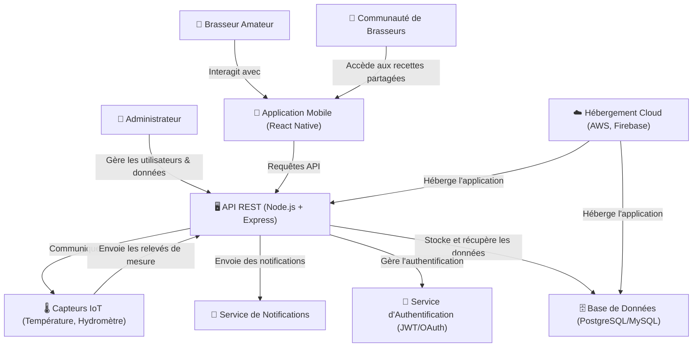

# 🏗️ Architecture Générale de Brasse-Bouillon

## 📌 Introduction

Ce document présente **l’architecture globale** de l’application **Brasse-Bouillon**. Il offre une **vue d’ensemble** du système, en mettant en évidence les **acteurs principaux**, les **composants techniques** et leurs **interactions**.

L’objectif est de fournir une **compréhension claire et modulaire** du projet, tout en permettant d’approfondir chaque module séparément dans des diagrammes détaillés.

---

## 📊 **Diagramme Général de l’Architecture**

---

## 📖 **Explication du Diagramme**

### **Acteurs Principaux**

- **👤 Brasseur Amateur** : Utilisateur principal de l’application, qui crée et suit ses recettes de brassage.
- **👥 Communauté de Brasseurs** : Utilisateurs partageant leurs recettes et interagissant avec d’autres brasseurs.
- **🔧 Administrateur** : Responsable de la gestion des utilisateurs et des données.

### **Composants Clés**

- **📱 Application Mobile (React Native)** : Interface utilisateur permettant de gérer les recettes, sessions de brassage et interactions communautaires.
- **🖥️ API REST (Node.js + Express)** : Backend gérant les requêtes, les sessions utilisateur et les recettes.
- **🗄️ Base de Données (PostgreSQL/MySQL)** : Stockage des données utilisateurs, recettes et sessions de brassage.
- **🌡️ Capteurs IoT** : Collecte et transmission des mesures de température et hydrométrie pour le suivi des brassins.
- **📢 Service de Notifications** : Envoi d’alertes et de rappels aux utilisateurs.

### **Services Externes**

- **🔑 Authentification (JWT/OAuth)** : Sécurisation des accès utilisateur.
- **☁️ Hébergement Cloud (AWS/Firebase)** : Déploiement du backend et stockage des données.

---

## 📌 **Conclusion**

Ce diagramme **résume l’ensemble de l’architecture** de Brasse-Bouillon. Chaque module sera détaillé dans des diagrammes spécifiques afin d’explorer leur fonctionnement interne.

📂 **Lieu du fichier** : `docs/architecture/application_architecture.md`
