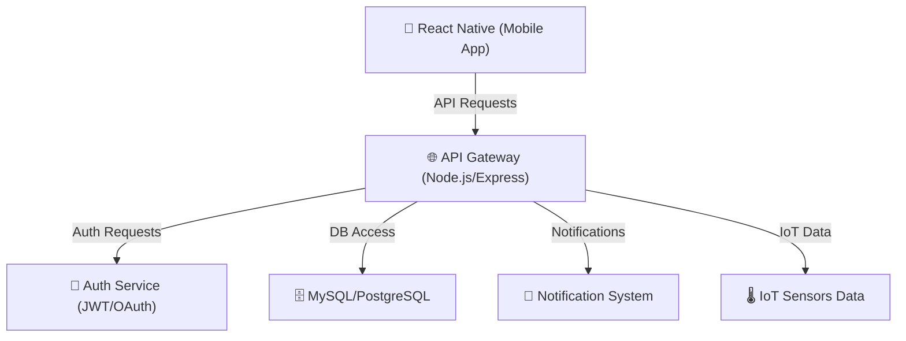

# 🌍 **Vue d'Ensemble de l'Architecture - Brasse-Bouillon**

## **1️⃣ Introduction**

🎯 **Objectif du document** :

- Fournir une **vue globale** de l'architecture de **Brasse-Bouillon**.
- Expliquer les **choix techniques** et les **flux de données**.
- Détail des stratégies de **sécurité, CI/CD et gestion des rôles**.

📌 **Pourquoi cette architecture ?**
✅ Scalabilité et performance.
✅ Sécurité renforcée.
✅ Code modulaire et maintenable.
✅ Automatisation du déploiement.

📌 **Documents de référence :**

- `component_diagram.md` → Diagramme des composants du projet.
- `data_flow_diagram.md` → Circulation des données et sécurité.
- `backend_architecture.md` → Détails techniques du backend.
- `frontend_architecture.md` → Structure et technologies du frontend.
- `database_schema.md` → Modèle relationnel et ORM.
- `api_interactions.md` → Définition des endpoints et API.
- `security_architecture.md` → Stratégie de sécurité appliquée.
- `maintenance_plan.md` → CI/CD et plan de maintenance.
- `performance_optimization.md` → Optimisations de performance et scalabilité.

---

## **2️⃣ Vue Globale de l'Architecture**

📌 **Schéma d’architecture des composants :**

📌 **Documents associés :** `component_diagram.md`, `data_flow_diagram.md`.

---

## **3️⃣ Choix Techniques et Justifications**

| **Technologie** | **Pourquoi ce choix ?** | **Alternatives envisagées ?** |
|----------------|-------------------------|----------------------------|
| **React Native** | Développement cross-platform | Flutter, Swift/Kotlin |
| **Node.js + Express** | API REST rapide et légère | Django (Python), Spring Boot (Java) |
| **MySQL + Sequelize** | Fiable, relationnel | PostgreSQL, MongoDB |
| **JWT + OAuth 2.0** | Authentification sécurisée | Session-based auth |
| **GitHub Actions** | CI/CD automatisé | Jenkins, GitLab CI |

📌 **Documents associés :** `backend_architecture.md`, `frontend_architecture.md`, `database_schema.md`.

---

## **4️⃣ Sécurité et Gestion des Accès**

📌 **Stratégies de sécurité :**
✅ **Authentification** : JWT, OAuth 2.0, 2FA.
✅ **Gestion des rôles** : RBAC (admin, brasseur, utilisateur).
✅ **Chiffrement des données** : AES-256 pour les données sensibles.
✅ **Protection API** : Rate Limiting, CORS, CSRF Tokens.
✅ **Monitoring et alertes** : Prometheus, Fail2Ban.

📌 **Documents associés :** `security_architecture.md`, `authentication_methods.md`, `data_protection.md`.

---

## **5️⃣ DevOps, CI/CD et Maintenance**

📌 **Stratégie CI/CD :**

- **Pipeline GitHub Actions** : Tests, linting, build, déploiement automatique.
- **Surveillance des logs et erreurs** (`PM2`, `Grafana`, `ELK Stack`).
- **Backup et récupération** (`mysqldump`, sauvegardes automatiques).

📌 **Gestion des environnements :**

| 🌍 **Environnement** | 📌 **Description** |
|----------------|----------------|
| **Développement** | Local, avec `nodemon` et BDD MySQL en local. |
| **Staging** | Pré-production avec CI/CD pour validation. |
| **Production** | Déploiement final sécurisé avec Docker et NGINX. |

📌 **Documents associés :** `maintenance_plan.md`, `performance_optimization.md`.

---

## **6️⃣ Prochaines Étapes**

📌 **Améliorations et mises à jour futures :**
✅ Ajouter des **tests de charge et de performance**.
✅ Renforcer la **surveillance de sécurité**.
✅ Planifier des **mises à jour régulières** pour les dépendances.

---

## **📌 Conclusion**

🎯 **L’architecture de Brasse-Bouillon est conçue pour être performante, sécurisée et évolutive.**
📢 **Merci pour votre attention et vos retours !** 🚀
