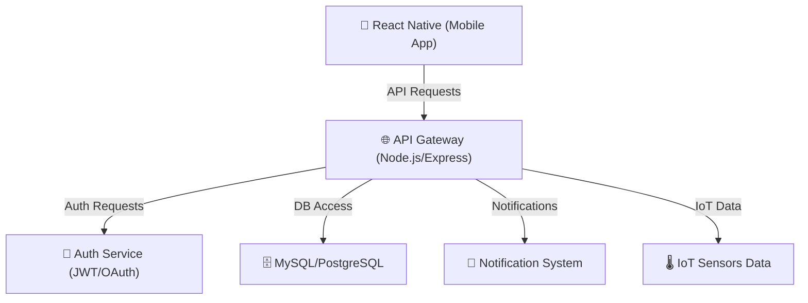

# 🌍 **Résumé de l'Architecture - Brasse-Bouillon**

## **1️⃣ Introduction**

🎯 **Objectif de ce document :**

- Fournir une **vue globale rapide** de l’architecture du projet **Brasse-Bouillon**.
- Guider les nouveaux développeurs en leur donnant un **point d’entrée unique**.
- Référencer tous les documents techniques détaillés.

📌 **À qui s’adresse ce document ?**
✅ Développeurs rejoignant le projet.
✅ Équipe technique en charge de la maintenance.
✅ Responsables projet souhaitant une vue d’ensemble.

---

## **2️⃣ Vue Globale de l’Architecture**

📌 **Schéma d’architecture des composants :**

📌 **Documents associés :** `component_diagram.md`, `data_flow_diagram.md`.

---

## **3️⃣ Résumé des Modules**

### 🔹 **Frontend (React Native)**

📌 Application mobile développée en **React Native** avec **Redux** pour la gestion d’état.

- 📂 **Documentation :** `frontend_architecture.md`

### 🔹 **Backend (Node.js + Express)**

📌 API REST développée en **Node.js + Express**, connectée à une base de données relationnelle.

- 📂 **Documentation :** `backend_architecture.md`

### 🔹 **Base de Données (MySQL/PostgreSQL)**

📌 Stockage structuré des données avec **Sequelize ORM**.

- 📂 **Documentation :** `database_schema.md`, `data_model.md`

### 🔹 **Sécurité et Authentification**

📌 Gestion des accès via **JWT, OAuth 2.0, 2FA** et **RBAC (Role-Based Access Control)**.

- 📂 **Documentation :** `security_architecture.md`, `authentication_methods.md`

### 🔹 **Intégration Continue & Déploiement (CI/CD)**

📌 Automatisation du déploiement via **GitHub Actions**, avec des tests et un pipeline sécurisé.

- 📂 **Documentation :** `maintenance_plan.md`, `performance_optimization.md`

---

## **4️⃣ Liens vers la Documentation Complète**

📌 **Tous les documents techniques détaillés :**

| 📂 **Catégorie** | 📄 **Fichier** |
|-----------------|-----------------|
| **Vue d'ensemble** | `architecture_overview.md` |
| **Composants** | `component_diagram.md` |
| **Flux de données** | `data_flow_diagram.md` |
| **Backend** | `backend_architecture.md` |
| **Frontend** | `frontend_architecture.md` |
| **Base de données** | `database_schema.md`, `data_model.md` |
| **API et interactions** | `api_interactions.md` |
| **Sécurité** | `security_architecture.md`, `authentication_methods.md`, `data_protection.md` |
| **CI/CD et Maintenance** | `maintenance_plan.md`, `performance_optimization.md` |

---

## **5️⃣ Premiers Pas pour Contribuer**

📌 **Étapes pour les nouveaux développeurs :**
1️⃣ **Lire `CONTRIBUTING.md`** pour comprendre le workflow Git et les conventions de développement.
2️⃣ **Installer l’environnement de développement** en suivant `getting_started.md`.
3️⃣ **Explorer les modules de l’architecture** en commençant par `architecture_overview.md`.
4️⃣ **Se connecter avec l’équipe** via Slack/Discord pour toute question.

📌 **Où poser des questions ?**

- Ouvrir une issue GitHub si un point technique n’est pas clair.
- Rejoindre les discussions internes pour échanger avec les autres développeurs.

---

## **📌 Conclusion**

🎯 **Ce document permet d’accéder rapidement aux informations essentielles** et sert de **point d’entrée** pour toute personne intégrant le projet.
📢 **Merci de lire les documents associés et de contribuer au projet Brasse-Bouillon ! 🚀**
