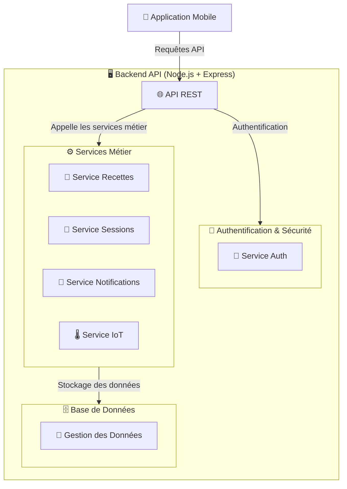

# 🏗️ **Backend - Brasse-Bouillon**  

Ce dossier **documente toute l’architecture backend** de l’application **Brasse-Bouillon**, en détaillant **les services API, la gestion des utilisateurs, la base de données et les optimisations de performance**.  

📌 **Technologies utilisées :**  
✅ **Node.js** avec **Express.js** comme framework backend.  
✅ **PostgreSQL/MySQL** pour le stockage des données.  
✅ **JWT (JSON Web Token)** pour l’authentification.  
✅ **Redis** pour le caching et l’optimisation des performances.  
✅ **MQTT / WebSockets** pour la communication en temps réel avec les capteurs IoT.  

---

## 📂 **Structure du Dossier**

📌 **Chaque fichier documente un aspect clé du backend.**  

### **1️⃣ 📖 Vue d'Ensemble**

| 📂 **Fichier** | 📌 **Description** |
|--------------|----------------|
| [`backend_architecture.md`](./backend_architecture.md) | 🏗️ Vue générale du backend et de son organisation. |
| [`api_interactions.md`](./api_interactions.md) | 🔌 Documentation des **endpoints API** et de leur utilisation. |

### **2️⃣ 🔑 Authentification & Sécurité**

| 📂 **Fichier** | 📌 **Description** |
|--------------|----------------|
| [`authentication_system.md`](./authentication_system.md) | 🔑 Gestion des utilisateurs et authentification **JWT/OAuth**. |

### **3️⃣ 🗄️ Base de Données**

| 📂 **Fichier** | 📌 **Description** |
|--------------|----------------|
| [`database_interactions.md`](./database_interactions.md) | 🗄️ Interaction avec la **base de données** et schémas relationnels. |

### **4️⃣ ⚙️ Services Métier**

📌 **Chaque service métier est documenté dans le dossier `services/`.**  

| 📂 **Service** | 📄 **Fichier** | 📌 **Description** |
|--------------|----------------|----------------|
| **Gestion des Recettes** | [`recipes_service.md`](./services/recipes_service.md) | CRUD et gestion des recettes |
| **Gestion des Sessions de Brassage** | [`sessions_service.md`](./services/sessions_service.md) | Suivi et gestion des sessions |
| **Service de Notifications** | [`notifications_service.md`](./services/notifications_service.md) | Gestion des alertes et notifications push |
| **Service IoT** | [`iot_service.md`](./services/iot_service.md) | Collecte et analyse des mesures des capteurs |

### **5️⃣ ⚡ Optimisation et Performances**

| 📂 **Fichier** | 📌 **Description** |
|--------------|----------------|
| [`performance_optimization.md`](./performance_optimization.md) | ⚡ Optimisations de performance et **scalabilité**. |

---

## 📊 **Schéma de l’Architecture Backend**

📌 **Aperçu global du fonctionnement du backend.**  

---

## 🚀 **Comment Contribuer ?**

📌 **Étapes pour modifier la documentation :**  
1️⃣ **Mettre à jour les fichiers concernés** dans `docs/architecture/backend/`.  
2️⃣ **Ajouter des exemples de code et des schémas UML** si nécessaire.  
3️⃣ **Créer une pull request** pour valider les modifications.  

