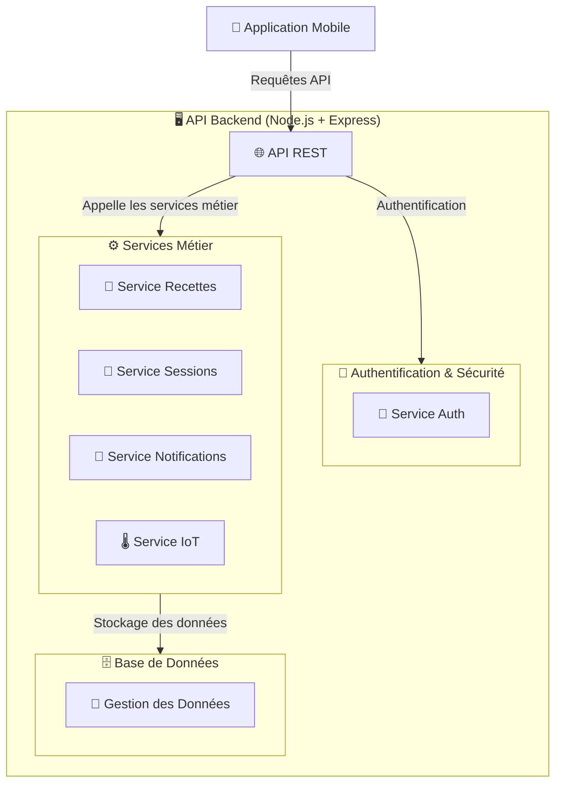

# 🌐 **Interactions avec l’API - Brasse-Bouillon**  

## 📌 **Introduction**  

L’API REST de **Brasse-Bouillon** assure la communication entre l’application mobile et le backend.  
Elle permet de gérer :  
✅ **Les utilisateurs et l’authentification** (JWT/OAuth).  
✅ **Les recettes de brassage** (CRUD).  
✅ **Les sessions de brassage** et leur suivi.  
✅ **Les notifications et interactions avec l’IoT**.  

📌 **Technologies utilisées :**  

- **Express.js** comme framework backend.  
- **JWT** pour l’authentification et la gestion des sessions utilisateur.  
- **PostgreSQL/MySQL** pour le stockage des données.  

---

## 📊 **Schéma Global des Interactions API (Niveau 2)**

📌 **Vue simplifiée des flux de communication entre le frontend et l’API backend.**  



---

## **🛠️ Endpoints de l’API**

Les endpoints sont regroupés en 4 grandes catégories :  

1️⃣ **Authentification & Utilisateurs**  
2️⃣ **Gestion des Recettes**  
3️⃣ **Gestion des Sessions de Brassage**  
4️⃣ **Notifications & IoT**  

### **1️⃣ Authentification & Gestion des Utilisateurs**

📌 **Fichier associé :** [`authentication_system.md`](./authentication_system.md)  

| Méthode | Endpoint | Description | Authentification |
|---------|------------|-------------|----------------|
| **POST** | `/auth/register` | Créer un nouvel utilisateur | ❌ |
| **POST** | `/auth/login` | Connexion utilisateur | ❌ |
| **POST** | `/auth/logout` | Déconnexion utilisateur | ✅ Token |
| **GET** | `/auth/me` | Récupère le profil connecté | ✅ Token |

📌 **Exemple d’appel API pour la connexion :**  

```bash
curl -X POST https://api.brasse-bouillon.com/auth/login \
     -H "Content-Type: application/json" \
     -d '{"email": "user@example.com", "password": "securepassword"}'
```

📌 **Réponse attendue :**  

```json
{
  "token": "eyJhbGciOiJIUzI1NiIsInR...",
  "user": {
    "id": 1,
    "email": "user@example.com",
    "role": "brasseur"
  }
}
```

---

### **2️⃣ Gestion des Recettes**

📌 **Fichier associé :** [`database_interactions.md`](./database_interactions.md)  

| Méthode | Endpoint | Description | Authentification |
|---------|------------|-------------|----------------|
| **GET** | `/recipes` | Récupère toutes les recettes | ❌ |
| **GET** | `/recipes/:id` | Récupère une recette spécifique | ❌ |
| **POST** | `/recipes` | Crée une nouvelle recette | ✅ Token |
| **PUT** | `/recipes/:id` | Met à jour une recette | ✅ Token |
| **DELETE** | `/recipes/:id` | Supprime une recette | ✅ Token (Admin) |

📌 **Exemple d’appel API pour récupérer toutes les recettes :**  

```bash
curl -X GET https://api.brasse-bouillon.com/recipes
```

---

### **3️⃣ Gestion des Sessions de Brassage**

📌 **Fichier associé :** [`database_interactions.md`](./database_interactions.md)  

| Méthode | Endpoint | Description | Authentification |
|---------|------------|-------------|----------------|
| **GET** | `/sessions` | Récupère toutes les sessions actives | ✅ Token |
| **POST** | `/sessions` | Crée une nouvelle session | ✅ Token |
| **PUT** | `/sessions/:id` | Met à jour une session | ✅ Token |
| **DELETE** | `/sessions/:id` | Supprime une session | ✅ Token |

📌 **Exemple d’appel API pour créer une session de brassage :**  

```bash
curl -X POST https://api.brasse-bouillon.com/sessions \
     -H "Authorization: Bearer {TOKEN}" \
     -H "Content-Type: application/json" \
     -d '{"recipeId": 1, "startTime": "2024-02-15T10:00:00Z"}'
```

---

### **4️⃣ Notifications & IoT**

📌 **Fichier associé :** [`notification_system.md`](../notifications/notifications_system.md)  

| Méthode | Endpoint | Description | Authentification |
|---------|------------|-------------|----------------|
| **GET** | `/notifications` | Récupère les notifications | ✅ Token |
| **POST** | `/notifications/send` | Envoie une notification | ✅ Token (Admin) |

📌 **Fichier associé :** [`iot_architecture.md`](../iot/iot_architecture.md)  

| Méthode | Endpoint | Description | Authentification |
|---------|------------|-------------|----------------|
| **GET** | `/iot/sensors` | Récupère les données IoT | ✅ Token |
| **POST** | `/iot/sensors` | Enregistre des données IoT | ✅ Token (Capteur) |

---
