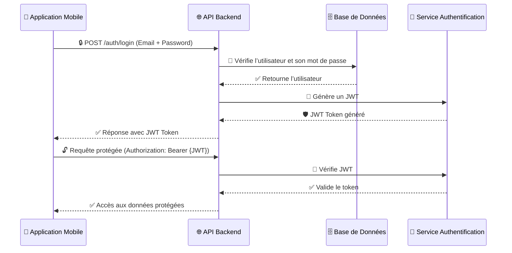

# 🔑 **Gestion de l'Authentification & Sécurité - Brasse-Bouillon**  

## 📌 **Introduction**  

L'authentification dans **Brasse-Bouillon** est basée sur **JWT (JSON Web Token)** et **OAuth 2.0** pour sécuriser l'accès aux ressources de l'API.  

📌 **Principaux objectifs de sécurité :**  
✅ **Authentifier les utilisateurs en toute sécurité** (JWT).  
✅ **Gérer les rôles et permissions** (Admin, Brasseur, Utilisateur).  
✅ **Protéger les endpoints sensibles** avec des **middlewares**.  
✅ **Sécuriser les tokens et leur stockage** (HTTPOnly cookies vs LocalStorage).  

📌 **Technologies utilisées :**  

- **JWT (JSON Web Token)** pour l’authentification sans session.  
- **OAuth 2.0** pour la connexion via des tiers (Google, Facebook).  
- **Bcrypt.js** pour le **hachage sécurisé des mots de passe**.  
- **Express Middleware** pour sécuriser les routes protégées.  

---

## 📊 **Schéma de l’Authentification**

📌 **Illustration du processus de connexion avec JWT et OAuth.**  



---

## **🛠️ 1️⃣ Gestion des Utilisateurs et Authentification JWT**

📌 **Endpoints concernés :** [`api_interactions.md`](./api_interactions.md)  

| Méthode | Endpoint | Description | Authentification |
|---------|------------|-------------|----------------|
| **POST** | `/auth/register` | Créer un nouvel utilisateur | ❌ |
| **POST** | `/auth/login` | Connexion utilisateur | ❌ |
| **POST** | `/auth/logout` | Déconnexion utilisateur | ✅ Token |
| **GET** | `/auth/me` | Récupère le profil connecté | ✅ Token |

📌 **Exemple de génération d’un JWT après connexion :**  

```javascript
const jwt = require("jsonwebtoken");

const generateToken = (user) => {
    return jwt.sign(
        { id: user.id, email: user.email, role: user.role },
        process.env.JWT_SECRET,
        { expiresIn: "24h" }
    );
};
```

📌 **Middleware de vérification du token JWT :**  

```javascript
const jwt = require("jsonwebtoken");

const verifyToken = (req, res, next) => {
    const token = req.headers.authorization?.split(" ")[1];
    if (!token) return res.status(401).json({ message: "Accès refusé" });

    try {
        const decoded = jwt.verify(token, process.env.JWT_SECRET);
        req.user = decoded;
        next();
    } catch (err) {
        res.status(403).json({ message: "Token invalide" });
    }
};

module.exports = verifyToken;
```

---

## **🔐 2️⃣ Gestion des Rôles et Permissions**

📌 **Rôles utilisateurs :**  

- **Admin** → Gestion complète de la plateforme.  
- **Brasseur** → Ajout et gestion des recettes.  
- **Utilisateur standard** → Accès en lecture aux recettes publiques.  

📌 **Middleware de vérification des rôles :**  

```javascript
const verifyRole = (role) => {
    return (req, res, next) => {
        if (req.user.role !== role) {
            return res.status(403).json({ message: "Accès interdit" });
        }
        next();
    };
};
```

📌 **Exemple d’utilisation pour protéger un endpoint :**  

```javascript
app.post("/recipes", verifyToken, verifyRole("brasseur"), async (req, res) => {
    // Création d’une recette
});
```

---

## **🔑 3️⃣ Authentification via OAuth 2.0**

📌 **Connexion via Google & Facebook avec Passport.js**  
📌 **Endpoints :** `/auth/google` et `/auth/facebook`  

📌 **Exemple d’implémentation OAuth avec Passport.js :**  

```javascript
const passport = require("passport");
const GoogleStrategy = require("passport-google-oauth20").Strategy;

passport.use(
    new GoogleStrategy(
        {
            clientID: process.env.GOOGLE_CLIENT_ID,
            clientSecret: process.env.GOOGLE_CLIENT_SECRET,
            callbackURL: "/auth/google/callback",
        },
        async (accessToken, refreshToken, profile, done) => {
            const user = await findOrCreateUser(profile);
            return done(null, user);
        }
    )
);
```

📌 **Redirection vers Google OAuth :**  

```javascript
app.get("/auth/google", passport.authenticate("google", { scope: ["profile", "email"] }));
```

📌 **Gestion du callback OAuth :**  

```javascript
app.get("/auth/google/callback",
    passport.authenticate("google", { failureRedirect: "/" }),
    (req, res) => {
        res.redirect("/dashboard");
    }
);
```

---

## **📉 4️⃣ Sécurisation Avancée & Protection des Données**

📌 **Protection contre les attaques courantes**  
✅ **Rate limiting** (protection contre les attaques par force brute).  
✅ **Hashage des mots de passe avec `bcrypt.js`**.  
✅ **Stockage sécurisé des tokens (HTTPOnly Cookies au lieu de LocalStorage)**.  
✅ **CORS & CSRF Protection**.  

📌 **Exemple de hachage des mots de passe avec bcrypt.js :**  

```javascript
const bcrypt = require("bcrypt");

const hashPassword = async (password) => {
    const salt = await bcrypt.genSalt(10);
    return await bcrypt.hash(password, salt);
};
```

📌 **Limiter les requêtes avec Express Rate Limit :**  

```javascript
const rateLimit = require("express-rate-limit");

const limiter = rateLimit({
    windowMs: 15 * 60 * 1000, // 15 minutes
    max: 100, // Limite de 100 requêtes par IP
    message: "Trop de requêtes, veuillez réessayer plus tard",
});

app.use("/auth/login", limiter);
```
