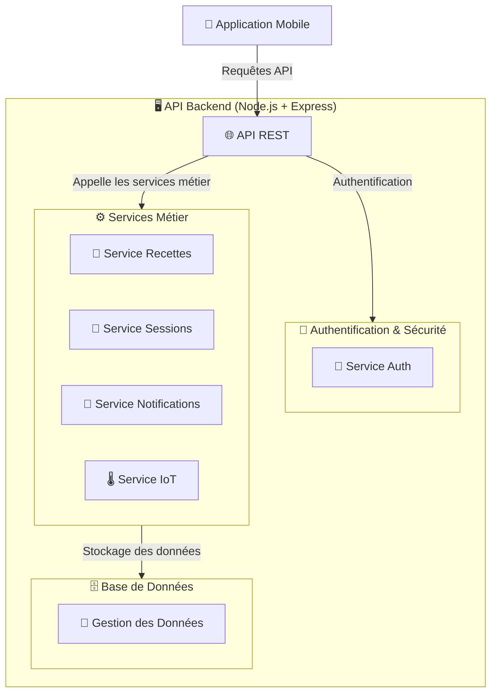

# 🏗️ **Architecture Backend - Brasse-Bouillon**  

## 📌 **Introduction**  

Le **backend** de **Brasse-Bouillon** repose sur **Node.js + Express.js** pour gérer l’API REST et interagir avec la base de données.  

📌 **Objectifs du backend :**  
✅ **Fournir une API REST robuste et sécurisée**.  
✅ **Gérer l’authentification et les rôles utilisateurs (JWT/OAuth)**.  
✅ **Stocker et manipuler les données des recettes et sessions de brassage**.  
✅ **Optimiser les performances via caching et scalabilité**.  

📌 **Technologies utilisées :**  

- **Express.js** (framework web pour Node.js).  
- **PostgreSQL/MySQL** (base de données relationnelle).  
- **Redis** (cache pour accélérer les requêtes fréquentes).  
- **JWT (JSON Web Token)** pour l’authentification.  
- **NGINX + PM2** pour la gestion de la montée en charge.  

---

## 📊 **Schéma de l’Architecture Backend (Niveau 2)**

📌 **Vue simplifiée du backend et ses sous-modules.**  



---

## **📁 Organisation des Modules Backend**

📌 **Chaque module est documenté séparément dans des fichiers dédiés.**  

| 📂 **Module** | 📄 **Fichier** | 📌 **Description** |
|--------------|------------------|----------------|
| **Architecture Backend** | [`backend_architecture.md`](./backend_architecture.md) | 🏗️ Vue globale du backend et de son organisation. |
| **API et Routes** | [`api_interactions.md`](./api_interactions.md) | 🌐 Documentation des **endpoints API** et interactions frontend. |
| **Authentification et Sécurité** | [`authentication_system.md`](./authentication_system.md) | 🔑 Gestion des utilisateurs, JWT et OAuth. |
| **Base de Données** | [`database_interactions.md`](./database_interactions.md) | 🗄️ Interaction avec la **base de données PostgreSQL/MySQL**. |
| **Optimisation Backend** | [`performance_optimization.md`](./performance_optimization.md) | ⚡ Optimisations de performance et scalabilité. |

---

## **🔑 1️⃣ Authentification & Sécurité**

📌 **Fichier détaillé :** [`authentication_system.md`](./authentication_system.md)  

📌 **Ce module gère :**  
✅ **Connexion et inscription des utilisateurs**.  
✅ **Authentification via JWT et OAuth 2.0**.  
✅ **Gestion des rôles (Admin, Brasseur, Utilisateur)**.  

📌 **Endpoints principaux :**  

| Méthode | Endpoint | Description | Authentification |
|---------|------------|-------------|----------------|
| **POST** | `/auth/register` | Création d’un utilisateur | ❌ |
| **POST** | `/auth/login` | Connexion avec JWT | ❌ |
| **GET** | `/auth/me` | Profil utilisateur connecté | ✅ Token |

---

## **🗄️ 2️⃣ Base de Données**

📌 **Fichier détaillé :** [`database_interactions.md`](./database_interactions.md)  

📌 **Ce module gère :**  
✅ **Stockage des utilisateurs, recettes et sessions**.  
✅ **Relations et transactions entre les tables**.  

📌 **Tables principales :**  

- `users` → Informations des utilisateurs.  
- `recipes` → Gestion des recettes de brassage.  
- `sessions` → Sessions de brassage en cours.  

---

## **⚙️ 3️⃣ Services Métier**

📌 **Fichier détaillé :** [`api_interactions.md`](./api_interactions.md)  

📌 **Ce module gère :**  
✅ **Gestion des recettes et sessions de brassage**.  
✅ **Envoi de notifications aux utilisateurs**.  
✅ **Traitement des données des capteurs IoT**.  

📌 **Endpoints principaux :**  

| Méthode | Endpoint | Description | Authentification |
|---------|------------|-------------|----------------|
| **GET** | `/recipes` | Liste des recettes | ❌ |
| **POST** | `/recipes` | Création d’une recette | ✅ Token |
| **GET** | `/sessions` | Liste des sessions actives | ✅ Token |

---

## **⚡ 4️⃣ Optimisation et Scalabilité**

📌 **Fichier détaillé :** [`performance_optimization.md`](./performance_optimization.md)  

📌 **Ce module gère :**  
✅ **Caching avec Redis pour optimiser la vitesse des requêtes**.  
✅ **Rate Limiting et Load Balancing pour gérer la montée en charge**.  
✅ **Optimisation des requêtes SQL avec indexation et pagination**.  

📌 **Optimisation clé :**  

```javascript
const redis = require("redis");
const client = redis.createClient();

const cacheMiddleware = (req, res, next) => {
    const key = req.originalUrl;
    client.get(key, (err, data) => {
        if (data) {
            return res.json(JSON.parse(data));
        }
        next();
    });
};
```

---
