# Architecture Backend - Brasse-Bouillon

## 1. Introduction

Ce document décrit la structure de l’architecture backend du projet **Brasse-Bouillon**, les technologies utilisées et l'organisation des fichiers. Il s’appuie sur les documents suivants pour garantir la cohérence avec l’ensemble du projet :

📌 **Documents de référence :**
- **`architecture_overview.md`** : Vue globale des composants du système.
- **`api_interactions.md`** : Décrit les interactions API.
- **`database_schema.md`** : Implémentation MySQL et ORM Sequelize.
- **`class_diagram.md`** : Définit les classes utilisées dans le backend.
- **`component_diagram.md`** : Décrit les interactions backend-frontend.
- **`performance_optimization.md`** : Liste les optimisations backend.

---

## 2. Structure des Dossiers

L'architecture backend suit une organisation modulaire pour assurer **maintenabilité, évolutivité et performance**.

📂 **Organisation recommandée du backend :**
```
/backend
 ├── src/
 │   ├── controllers/      # Gestion des requêtes API
 │   ├── models/           # Modèles de données (ORM Sequelize)
 │   ├── routes/           # Définition des routes API
 │   ├── services/         # Logique métier (services)
 │   ├── middlewares/      # Middleware d’authentification, validation
 │   ├── config/           # Configuration (env, DB, JWT, Redis)
 │   ├── utils/            # Fonctions utilitaires
 │   ├── tests/            # Tests unitaires et d’intégration
 │   ├── index.js          # Point d’entrée du backend
```

---

## 3. Technologies Utilisées

| Technologie              | Rôle                         |
| ------------------------ | ---------------------------- |
| **Node.js**              | Serveur backend              |
| **Express.js**           | Framework web                |
| **MySQL + Sequelize**    | Base de données et ORM       |
| **JWT (JSON Web Token)** | Authentification             |
| **Redis**                | Caching et gestion des sessions |
| **NGINX + PM2**          | Load balancing et gestion des processus |
| **Jest / Mocha**         | Tests unitaires              |
| **Docker**               | Conteneurisation (optionnel) |

---

## 4. Explication des Composants Backend

- **Controllers :** Gestion des requêtes API et réponse aux clients.
- **Models :** Définition des schémas de base de données via ORM.
- **Routes :** Définition des routes API et validation des requêtes.
- **Services :** Logique métier, intégration des modèles et gestion des données.
- **Middlewares :** Sécurité, authentification JWT, gestion des erreurs.
- **Config :** Gestion des variables d’environnement et de la connexion à la base de données.
- **Tests :** Stratégie de tests unitaires et d’intégration pour assurer la qualité du code.

---

## 5. Schéma UML de l'Architecture Backend

```mermaid
graph TD;
    Client["🌍 Client (Frontend/IoT)"] -->|Requêtes API| API_Gateway["🌐 API Gateway (Express)"]
    API_Gateway -->|Gestion Authentification| Auth_Service["🔑 Auth Service (JWT/Redis)"]
    API_Gateway -->|Gestion Recettes| Recipe_Service["📖 Service Recettes"]
    API_Gateway -->|Gestion Sessions| Brew_Session_Service["🍺 Service Sessions"]
    API_Gateway -->|Gestion Notifications| Notification_Service["📢 Service Notifications"]
    API_Gateway -->|Base de Données| Database["🗄️ MySQL Database"]
```



---

## 6. Alignement avec l'Architecture Globale

📌 **Références aux autres documents d’architecture :**

| Document | Rôle |
|------------|------------|
| **`api_interactions.md`** | Liste des API et de leurs flux |
| **`database_schema.md`** | Décrit l’implémentation MySQL et ORM |
| **`class_diagram.md`** | Définit les classes et leurs interactions |
| **`component_diagram.md`** | Décrit les interactions entre le backend et les autres services |
| **`performance_optimization.md`** | Liste des optimisations backend (Redis, Load Balancing) |

---

## **Conclusion**

Ce document fournit une **référence claire pour le développement du backend**, garantissant **modularité, maintenabilité et évolutivité**.

