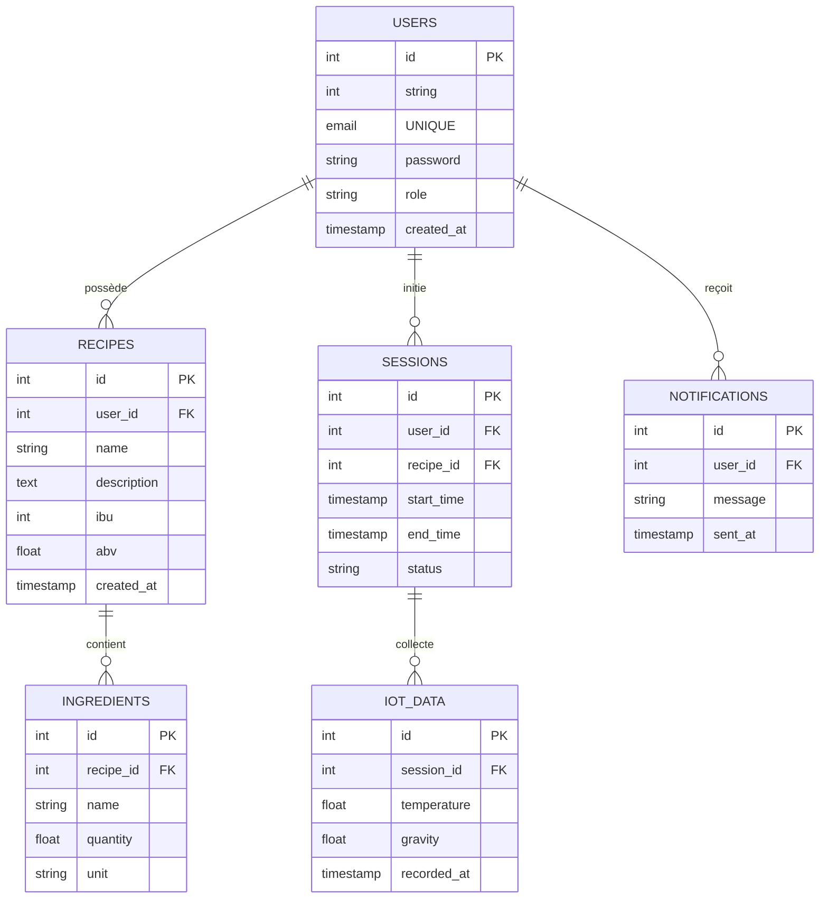

# 🗄️ **Interactions avec la Base de Données - Brasse-Bouillon**  

## 📌 **Introduction**  

La base de données de **Brasse-Bouillon** stocke toutes les informations essentielles à l’application, notamment :  
✅ **Les utilisateurs et leurs rôles**.  
✅ **Les recettes et leurs ingrédients**.  
✅ **Les sessions de brassage et leur historique**.  
✅ **Les notifications et les interactions IoT**.  

📌 **Technologies utilisées :**  

- **PostgreSQL** (choix principal, scalable et robuste).  
- **MySQL** (option secondaire en fonction du déploiement).  
- **Sequelize ORM** pour faciliter les requêtes SQL et la gestion des migrations.  

---

## 📊 **Schéma Global de la Base de Données**

📌 **Illustration de la relation entre les tables principales.**  



---

## **🛠️ 1️⃣ Définition des Tables Principales**

📌 **Chaque table est expliquée avec sa structure SQL et ses relations.**  

### **📌 Table `users` - Gestion des Utilisateurs**

📌 **Stocke les informations des utilisateurs et leurs rôles.**  

```sql
CREATE TABLE users (
    id SERIAL PRIMARY KEY,
    email VARCHAR(255) UNIQUE NOT NULL,
    password TEXT NOT NULL,
    role VARCHAR(50) CHECK (role IN ('admin', 'brasseur', 'utilisateur')) NOT NULL,
    created_at TIMESTAMP DEFAULT CURRENT_TIMESTAMP
);
```

---

### **📌 Table `recipes` - Gestion des Recettes**

📌 **Contient toutes les recettes enregistrées par les utilisateurs.**  

```sql
CREATE TABLE recipes (
    id SERIAL PRIMARY KEY,
    user_id INT REFERENCES users(id) ON DELETE CASCADE,
    name VARCHAR(255) NOT NULL,
    description TEXT,
    ibu INT,
    abv FLOAT,
    created_at TIMESTAMP DEFAULT CURRENT_TIMESTAMP
);
```

---

### **📌 Table `ingredients` - Gestion des Ingrédients**

📌 **Chaque recette est composée de plusieurs ingrédients.**  

```sql
CREATE TABLE ingredients (
    id SERIAL PRIMARY KEY,
    recipe_id INT REFERENCES recipes(id) ON DELETE CASCADE,
    name VARCHAR(255) NOT NULL,
    quantity FLOAT NOT NULL,
    unit VARCHAR(50) NOT NULL
);
```

---

### **📌 Table `sessions` - Sessions de Brassage**

📌 **Permet de suivre l’évolution d’un brassage en cours.**  

```sql
CREATE TABLE sessions (
    id SERIAL PRIMARY KEY,
    user_id INT REFERENCES users(id) ON DELETE CASCADE,
    recipe_id INT REFERENCES recipes(id) ON DELETE SET NULL,
    start_time TIMESTAMP DEFAULT CURRENT_TIMESTAMP,
    end_time TIMESTAMP,
    status VARCHAR(50) CHECK (status IN ('en cours', 'terminée', 'annulée')) NOT NULL
);
```

---

### **📌 Table `notifications` - Gestion des Notifications**

📌 **Stocke les alertes envoyées aux utilisateurs.**  

```sql
CREATE TABLE notifications (
    id SERIAL PRIMARY KEY,
    user_id INT REFERENCES users(id) ON DELETE CASCADE,
    message TEXT NOT NULL,
    sent_at TIMESTAMP DEFAULT CURRENT_TIMESTAMP
);
```

---

### **📌 Table `iot_data` - Collecte des Données des Capteurs IoT**

📌 **Permet de stocker les mesures envoyées par les capteurs IoT.**  

```sql
CREATE TABLE iot_data (
    id SERIAL PRIMARY KEY,
    session_id INT REFERENCES sessions(id) ON DELETE CASCADE,
    temperature FLOAT,
    gravity FLOAT,
    recorded_at TIMESTAMP DEFAULT CURRENT_TIMESTAMP
);
```

---

## **🔄 2️⃣ Interaction du Backend avec la Base de Données**

📌 **Utilisation de Sequelize ORM pour gérer les requêtes.**  

📌 **Exemple de Modèle Sequelize pour `users` :**  

```javascript
const { DataTypes } = require("sequelize");
const sequelize = require("../config/database");

const User = sequelize.define("User", {
    id: { type: DataTypes.INTEGER, primaryKey: true, autoIncrement: true },
    email: { type: DataTypes.STRING, allowNull: false, unique: true },
    password: { type: DataTypes.TEXT, allowNull: false },
    role: { 
        type: DataTypes.ENUM("admin", "brasseur", "utilisateur"), 
        allowNull: false 
    },
}, { timestamps: true });

module.exports = User;
```

---

📌 **Exemple de requête SQL avec Sequelize :**  

```javascript
const User = require("../models/User");

async function getUserByEmail(email) {
    return await User.findOne({ where: { email } });
}
```

---

## **⚡ 3️⃣ Optimisation et Sécurisation des Requêtes SQL**

📌 **Bonnes pratiques pour améliorer la performance et la sécurité.**  

✅ **Utiliser des index pour accélérer les recherches.**  

```sql
CREATE INDEX idx_users_email ON users(email);
```

✅ **Gérer les transactions SQL pour éviter les corruptions de données.**  

```javascript
const { sequelize } = require("../config/database");

async function updateRecipeAndSession(recipeId, sessionId) {
    const transaction = await sequelize.transaction();
    try {
        await Recipe.update({ name: "New Name" }, { where: { id: recipeId }, transaction });
        await Session.update({ status: "terminée" }, { where: { id: sessionId }, transaction });
        await transaction.commit();
    } catch (error) {
        await transaction.rollback();
    }
}
```

✅ **Prévenir les injections SQL avec Sequelize ou des requêtes préparées.**  
