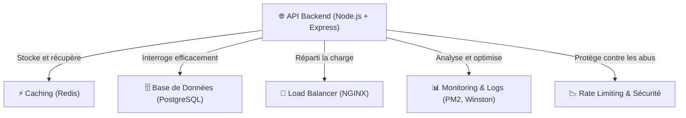

# ⚡ **Optimisation des Performances Backend - Brasse-Bouillon**  

## 📌 **Introduction**  

L’optimisation des performances du backend **est essentielle** pour garantir :  
✅ **Une API rapide et réactive**, même avec de nombreuses requêtes simultanées.  
✅ **Une base de données bien optimisée**, évitant les ralentissements.  
✅ **Un système scalable**, capable de gérer une montée en charge.  

📌 **Stratégies d’optimisation couvertes dans ce document :**  
1️⃣ **Caching pour réduire les requêtes inutiles**.  
2️⃣ **Optimisation des requêtes SQL et pagination**.  
3️⃣ **Gestion de la charge avec Load Balancing**.  
4️⃣ **Optimisation des logs et monitoring des performances**.  
5️⃣ **Sécurisation et limitation des requêtes (Rate Limiting, Compression)**.  

📌 **Technologies utilisées :**  

- **Redis** pour le caching.  
- **Sequelize ORM** pour optimiser les requêtes SQL.  
- **NGINX / Load Balancing** pour répartir la charge.  
- **Express Rate Limit** pour éviter les abus API.  
- **PM2 / Cluster Mode** pour exécuter plusieurs instances du serveur.  

---

## 📊 **Schéma Global des Optimisations Backend**

📌 **Vue simplifiée des optimisations appliquées.**  



---

## **🛠️ 1️⃣ Mise en Place d’un Caching (Redis)**

📌 **Objectif :** **Réduire le nombre de requêtes répétitives** vers la base de données en mettant en cache les réponses API.  

📌 **Exemple de mise en cache avec Redis :**  

```javascript
const redis = require("redis");
const client = redis.createClient();

const cacheMiddleware = (req, res, next) => {
    const key = req.originalUrl;
    client.get(key, (err, data) => {
        if (data) {
            return res.json(JSON.parse(data));
        }
        next();
    });
};

app.get("/recipes", cacheMiddleware, async (req, res) => {
    const recipes = await Recipe.findAll();
    client.setex(req.originalUrl, 3600, JSON.stringify(recipes)); // Cache pour 1h
    res.json(recipes);
});
```

✅ **Avantages du caching Redis :**  
✔ **Diminution du temps de réponse** (évite les requêtes répétées en base).  
✔ **Déchargement de la base de données** (moins de lecture).  

---

## **🔍 2️⃣ Optimisation des Requêtes SQL**

📌 **Objectif :** Réduire **les requêtes lourdes** et améliorer **les performances SQL**.  

📌 **Indexation des colonnes fréquemment interrogées :**  

```sql
CREATE INDEX idx_users_email ON users(email);
CREATE INDEX idx_recipes_name ON recipes(name);
```

📌 **Pagination efficace pour éviter le chargement de grandes quantités de données :**  

```javascript
app.get("/recipes", async (req, res) => {
    const { page = 1, limit = 10 } = req.query;
    const offset = (page - 1) * limit;
    
    const recipes = await Recipe.findAndCountAll({
        limit: parseInt(limit),
        offset: parseInt(offset)
    });

    res.json({
        total: recipes.count,
        page: page,
        totalPages: Math.ceil(recipes.count / limit),
        data: recipes.rows
    });
});
```

✅ **Pourquoi c’est important ?**  
✔ **Évite les requêtes SQL volumineuses**.  
✔ **Charge les données progressivement** plutôt que tout en une seule fois.  

---

## **🔀 3️⃣ Load Balancing & Scalabilité**

📌 **Objectif :** **Gérer un grand nombre de requêtes** sans surcharge d’un seul serveur.  

📌 **Exemple de configuration `NGINX` pour Load Balancing :**  

```nginx
upstream backend_servers {
    server backend1:3000;
    server backend2:3000;
}

server {
    listen 80;
    location / {
        proxy_pass http://backend_servers;
    }
}
```

✅ **Avantages :**  
✔ **Répartit la charge entre plusieurs instances**.  
✔ **Améliore la haute disponibilité** du backend.  

---

## **📊 4️⃣ Monitoring et Optimisation des Logs**

📌 **Objectif :** Suivre les performances et détecter les problèmes en temps réel.  

📌 **Utilisation de PM2 pour gérer les processus Node.js**  

```bash
pm2 start server.js -i max  # Démarre plusieurs instances
pm2 monit  # Affiche les logs en temps réel
```

📌 **Utilisation de Winston pour logger les erreurs et les performances**  

```javascript
const winston = require("winston");

const logger = winston.createLogger({
    level: "info",
    transports: [
        new winston.transports.Console(),
        new winston.transports.File({ filename: "logs/error.log", level: "error" })
    ]
});

logger.info("API démarrée avec succès !");
logger.error("Erreur critique détectée !");
```

✅ **Pourquoi utiliser du monitoring ?**  
✔ **Détecter les erreurs en temps réel**.  
✔ **Analyser les performances et optimiser les requêtes lentes**.  

---

## **📉 5️⃣ Sécurisation et Limitation des Requêtes**

📌 **Objectif :** **Empêcher les attaques par déni de service (DoS) et les abus d’API.**  

📌 **Utilisation de `express-rate-limit` pour limiter le nombre de requêtes :**  

```javascript
const rateLimit = require("express-rate-limit");

const limiter = rateLimit({
    windowMs: 15 * 60 * 1000, // 15 minutes
    max: 100, // 100 requêtes max par IP
    message: "Trop de requêtes, veuillez réessayer plus tard."
});

app.use("/auth/login", limiter);
```

📌 **Compression des réponses API pour réduire la bande passante**  

```javascript
const compression = require("compression");
app.use(compression());
```

✅ **Pourquoi ces mesures sont importantes ?**  
✔ **Empêche les attaques par force brute** sur l’authentification.  
✔ **Améliore les performances en réduisant la taille des réponses**.  
