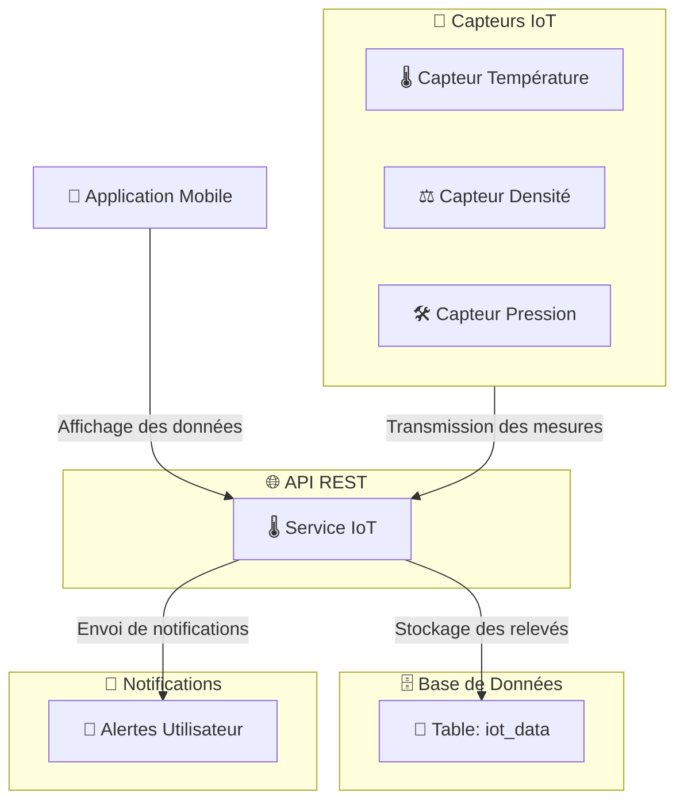

# 🌡️ **Service IoT - Brasse-Bouillon**  

## 📌 **Introduction**  

Le **service IoT** permet de connecter des capteurs **(température, densité, pression, etc.)** à l’application pour suivre en temps réel l’évolution des sessions de brassage.  

📌 **Objectifs du service :**  
✅ **Collecter et stocker les données des capteurs en temps réel.**  
✅ **Analyser les données pour détecter d’éventuelles anomalies.**  
✅ **Notifier l’utilisateur en cas de dépassement des seuils critiques.**  
✅ **Afficher les mesures en temps réel sur l’application mobile.**  

📌 **Technologies utilisées :**  

- **MQTT / WebSockets** pour la communication en temps réel.  
- **Express.js** pour l’API REST.  
- **PostgreSQL** pour stocker les relevés des capteurs.  
- **Redis** pour gérer le caching des dernières mesures.  

---

## 📊 **Schéma d’Interaction du Service**

📌 **Illustration des flux de gestion des capteurs IoT.**  



---

## **🛠️ 1️⃣ Endpoints du Service IoT**

📌 **Ce service expose les endpoints suivants :**  

| Méthode | Endpoint | Description | Authentification |
|---------|------------|-------------|----------------|
| **GET** | `/iot/sensors` | Récupère les dernières données des capteurs | ✅ Token |
| **POST** | `/iot/sensors` | Enregistre de nouvelles données IoT | ✅ Token (Capteur) |
| **GET** | `/iot/sensors/:sessionId` | Récupère les données d’une session spécifique | ✅ Token |

📌 **Exemple d’appel API pour récupérer les données IoT d’une session :**  

```bash
curl -X GET https://api.brasse-bouillon.com/iot/sensors/1 \
     -H "Authorization: Bearer {TOKEN}"
```

📌 **Réponse attendue :**  

```json
[
  {
    "sessionId": 1,
    "temperature": 20.5,
    "gravity": 1.045,
    "pressure": 1.2,
    "recordedAt": "2024-02-15T14:30:00Z"
  }
]
```

---

## **🗄️ 2️⃣ Modèle de Base de Données**

📌 **Table principale utilisée pour stocker les mesures des capteurs :**  

### **Table `iot_data`**

```sql
CREATE TABLE iot_data (
    id SERIAL PRIMARY KEY,
    session_id INT REFERENCES sessions(id) ON DELETE CASCADE,
    temperature FLOAT,
    gravity FLOAT,
    pressure FLOAT,
    recorded_at TIMESTAMP DEFAULT CURRENT_TIMESTAMP
);
```

📌 **Indexation pour optimiser les requêtes fréquentes :**  

```sql
CREATE INDEX idx_session_id ON iot_data(session_id);
```

✅ **Pourquoi stocker les données ?**  
✔ **Permet d’afficher l’historique des mesures.**  
✔ **Aide à l’analyse et à l’optimisation du brassage.**  

---

## **📡 3️⃣ Communication avec les Capteurs IoT**

📌 **Utilisation de MQTT pour la communication en temps réel avec les capteurs.**  

📌 **Exemple de gestion des capteurs via MQTT avec `mosquitto` :**  

```javascript
const mqtt = require("mqtt");
const client = mqtt.connect("mqtt://broker.hivemq.com");

client.on("connect", () => {
    client.subscribe("brasse-bouillon/sensors");
});

client.on("message", (topic, message) => {
    const data = JSON.parse(message.toString());
    console.log("Données IoT reçues :", data);
});
```

📌 **Exemple de message MQTT reçu :**  

```json
{
  "sessionId": 1,
  "temperature": 21.0,
  "gravity": 1.040,
  "pressure": 1.3
}
```

✅ **Pourquoi MQTT ?**  
✔ **Léger et adapté aux communications en temps réel**.  
✔ **Optimisé pour les capteurs à faible consommation**.  

---

## **📢 4️⃣ Détection d’Anomalies et Alertes**

📌 **Ce service surveille les capteurs et envoie des alertes en cas d’anomalie.**  

📌 **Exemple de détection de seuil critique :**  

```javascript
const checkThresholds = (data) => {
    if (data.temperature > 25) {
        sendNotification(data.sessionId, "⚠️ Température trop élevée !");
    }
};

client.on("message", (topic, message) => {
    const data = JSON.parse(message.toString());
    checkThresholds(data);
});
```

✅ **Pourquoi cette fonctionnalité ?**  
✔ **Aide à éviter les erreurs de brassage**.  
✔ **Améliore la qualité et la précision du brassage**.  

---

## **⚡ 5️⃣ Optimisation et Caching**

📌 **Mise en cache des dernières mesures pour éviter des requêtes SQL répétées.**  

📌 **Exemple de mise en cache avec Redis :**  

```javascript
const redis = require("redis");
const client = redis.createClient();

const cacheMiddleware = (req, res, next) => {
    const key = `iot_data:${req.params.sessionId}`;
    client.get(key, (err, data) => {
        if (data) {
            return res.json(JSON.parse(data));
        }
        next();
    });
};

app.get("/iot/sensors/:sessionId", cacheMiddleware, async (req, res) => {
    const iotData = await IoTData.findAll({ where: { session_id: req.params.sessionId } });
    client.setex(`iot_data:${req.params.sessionId}`, 600, JSON.stringify(iotData));
    res.json(iotData);
});
```

✅ **Avantages du caching :**  
✔ **Temps de réponse rapide**.  
✔ **Réduction de la charge sur la base de données**.  
