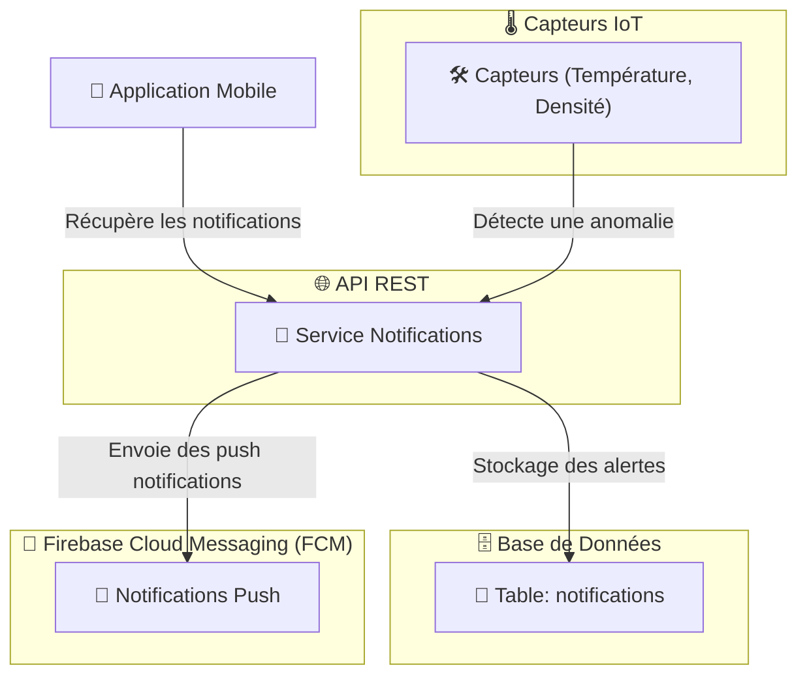

# 📢 **Service de Notifications - Brasse-Bouillon**  

## 📌 **Introduction**  

Le **service de notifications** envoie des **alertes et rappels** aux utilisateurs pour améliorer leur expérience et les aider à suivre leurs sessions de brassage.  

📌 **Objectifs du service :**  
✅ **Notifier les utilisateurs des événements clés (session terminée, température anormale, rappel d’action).**  
✅ **Envoyer des notifications push vers l’application mobile.**  
✅ **Stocker un historique des notifications envoyées.**  
✅ **Gérer les préférences de notification des utilisateurs.**  

📌 **Technologies utilisées :**  

- **Firebase Cloud Messaging (FCM)** pour les notifications push.  
- **WebSockets pour les alertes en temps réel.**  
- **Sequelize ORM** pour stocker les notifications.  

---

## 📊 **Schéma d’Interaction du Service**

📌 **Illustration des flux de gestion des notifications.**  



---

## **🛠️ 1️⃣ Endpoints du Service**

📌 **Ce service expose les endpoints suivants :**  

| Méthode | Endpoint | Description | Authentification |
|---------|------------|-------------|----------------|
| **GET** | `/notifications` | Récupère les notifications d’un utilisateur | ✅ Token |
| **POST** | `/notifications/send` | Envoie une notification à un utilisateur | ✅ Token (Admin) |
| **PUT** | `/notifications/preferences` | Met à jour les préférences de notifications | ✅ Token |

📌 **Exemple d’appel API pour récupérer les notifications d’un utilisateur :**  

```bash
curl -X GET https://api.brasse-bouillon.com/notifications \
     -H "Authorization: Bearer {TOKEN}"
```

📌 **Réponse attendue :**  

```json
[
  {
    "id": 1,
    "userId": 1,
    "message": "Votre fermentation a atteint 20°C !",
    "sentAt": "2024-02-15T14:45:00Z"
  }
]
```

---

## **🗄️ 2️⃣ Modèle de Base de Données**

📌 **Table principale utilisée dans ce service :**  

### **Table `notifications`**

```sql
CREATE TABLE notifications (
    id SERIAL PRIMARY KEY,
    user_id INT REFERENCES users(id) ON DELETE CASCADE,
    message TEXT NOT NULL,
    sent_at TIMESTAMP DEFAULT CURRENT_TIMESTAMP
);
```

📌 **Stockage des préférences de notification :**  

```sql
CREATE TABLE notification_preferences (
    id SERIAL PRIMARY KEY,
    user_id INT REFERENCES users(id) ON DELETE CASCADE,
    enable_push BOOLEAN DEFAULT true,
    enable_email BOOLEAN DEFAULT false
);
```

---

## **📲 3️⃣ Intégration avec Firebase Cloud Messaging (FCM)**

📌 **Utilisation de Firebase pour envoyer des notifications push aux utilisateurs.**  

📌 **Exemple de code pour envoyer une notification push avec FCM :**  

```javascript
const admin = require("firebase-admin");
admin.initializeApp({ credential: admin.credential.cert("firebase-key.json") });

const sendPushNotification = async (deviceToken, message) => {
    const payload = {
        notification: {
            title: "Brasse-Bouillon",
            body: message
        },
        token: deviceToken
    };

    try {
        await admin.messaging().send(payload);
        console.log("Notification envoyée !");
    } catch (error) {
        console.error("Erreur d'envoi de notification :", error);
    }
};
```

📌 **Exemple d’appel API pour envoyer une notification push :**  

```bash
curl -X POST https://api.brasse-bouillon.com/notifications/send \
     -H "Authorization: Bearer {TOKEN}" \
     -H "Content-Type: application/json" \
     -d '{"userId": 1, "message": "Votre brassage est terminé !"}'
```

📌 **Réponse attendue :**  

```json
{
  "success": true,
  "message": "Notification envoyée avec succès"
}
```

✅ **Pourquoi utiliser Firebase ?**  
✔ **Fiabilité et scalabilité**.  
✔ **Compatibilité avec iOS et Android**.  

---

## **📡 4️⃣ Intégration avec les Capteurs IoT**

📌 **Les capteurs IoT peuvent envoyer des alertes en cas d’anomalie.**  

📌 **Exemple de message IoT déclenchant une alerte :**  

```json
{
  "sessionId": 1,
  "temperature": 25.5,
  "alert": "Température trop élevée"
}
```

📌 **Gestion des alertes avec WebSockets :**  

```javascript
const WebSocket = require("ws");
const wss = new WebSocket.Server({ port: 8080 });

wss.on("connection", (ws) => {
    ws.on("message", (message) => {
        const data = JSON.parse(message);
        sendPushNotification(data.userId, data.alert);
    });
});
```

✅ **Avantages de WebSockets :**  
✔ **Alertes en temps réel**.  
✔ **Réactivité immédiate** en cas de problème.  

---

## **⚡ 5️⃣ Optimisation et Sécurisation**

📌 **Mise en cache des notifications récurrentes pour éviter des requêtes SQL répétées.**  

📌 **Exemple de mise en cache avec Redis :**  

```javascript
const redis = require("redis");
const client = redis.createClient();

const cacheMiddleware = (req, res, next) => {
    const key = `notifications:${req.user.id}`;
    client.get(key, (err, data) => {
        if (data) {
            return res.json(JSON.parse(data));
        }
        next();
    });
};

app.get("/notifications", cacheMiddleware, async (req, res) => {
    const notifications = await Notification.findAll({ where: { userId: req.user.id } });
    client.setex(`notifications:${req.user.id}`, 3600, JSON.stringify(notifications));
    res.json(notifications);
});
```

✅ **Avantages du caching :**  
✔ **Moins de charge sur la base de données**.  
✔ **Accès rapide aux notifications**.  
