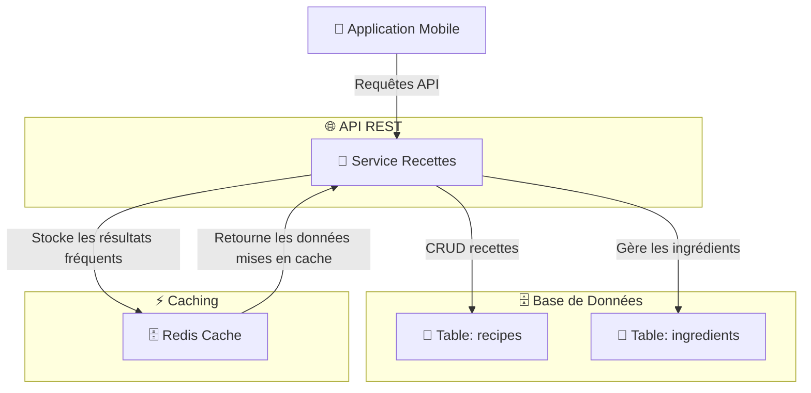

# 📖 **Service de Gestion des Recettes - Brasse-Bouillon**  

## 📌 **Introduction**  

Le **service de gestion des recettes** est responsable de la création, modification, suppression et récupération des recettes de brassage.  

📌 **Objectifs du service :**  
✅ **Permettre aux brasseurs de créer et gérer leurs recettes**.  
✅ **Stocker les informations des recettes dans la base de données**.  
✅ **Associer des ingrédients à chaque recette**.  
✅ **Optimiser l’accès aux recettes avec pagination et caching**.  

📌 **Technologies utilisées :**  

- **Express.js** (gestion des routes et API REST).  
- **Sequelize ORM** (manipulation des données SQL).  
- **Redis** (caching des recettes populaires).  

---

## 📊 **Schéma d’Interaction du Service**

📌 **Illustration des flux de gestion des recettes.**  



---

## **🛠️ 1️⃣ Endpoints du Service**

📌 **Ce service expose les endpoints suivants :**  

| Méthode | Endpoint | Description | Authentification |
|---------|------------|-------------|----------------|
| **GET** | `/recipes` | Récupère toutes les recettes | ❌ |
| **GET** | `/recipes/:id` | Récupère une recette spécifique | ❌ |
| **POST** | `/recipes` | Crée une nouvelle recette | ✅ Token |
| **PUT** | `/recipes/:id` | Met à jour une recette existante | ✅ Token |
| **DELETE** | `/recipes/:id` | Supprime une recette | ✅ Token (Admin) |

📌 **Exemple d’appel API pour récupérer toutes les recettes :**  

```bash
curl -X GET https://api.brasse-bouillon.com/recipes
```

📌 **Réponse attendue :**  

```json
[
  {
    "id": 1,
    "name": "IPA Maison",
    "ibu": 45,
    "abv": 5.8,
    "ingredients": [
      {"name": "Malt Pale Ale", "quantity": 5, "unit": "kg"},
      {"name": "Houblon Cascade", "quantity": 50, "unit": "g"}
    ]
  }
]
```

---

## **🗄️ 2️⃣ Modèle de Base de Données**

📌 **Tables principales utilisées dans ce service :**  

### **Table `recipes`**

```sql
CREATE TABLE recipes (
    id SERIAL PRIMARY KEY,
    user_id INT REFERENCES users(id) ON DELETE CASCADE,
    name VARCHAR(255) NOT NULL,
    description TEXT,
    ibu INT,
    abv FLOAT,
    created_at TIMESTAMP DEFAULT CURRENT_TIMESTAMP
);
```

### **Table `ingredients`**

```sql
CREATE TABLE ingredients (
    id SERIAL PRIMARY KEY,
    recipe_id INT REFERENCES recipes(id) ON DELETE CASCADE,
    name VARCHAR(255) NOT NULL,
    quantity FLOAT NOT NULL,
    unit VARCHAR(50) NOT NULL
);
```

---

## **⚡ 3️⃣ Optimisation et Caching**

📌 **Optimisation des requêtes avec Redis** pour les recettes fréquemment demandées.  

📌 **Middleware de caching avec Redis :**  

```javascript
const redis = require("redis");
const client = redis.createClient();

const cacheMiddleware = (req, res, next) => {
    const key = req.originalUrl;
    client.get(key, (err, data) => {
        if (data) {
            return res.json(JSON.parse(data));
        }
        next();
    });
};

app.get("/recipes", cacheMiddleware, async (req, res) => {
    const recipes = await Recipe.findAll();
    client.setex(req.originalUrl, 3600, JSON.stringify(recipes)); // Cache pour 1h
    res.json(recipes);
});
```

✅ **Pourquoi utiliser Redis ?**  
✔ **Réduction des requêtes SQL répétées**.  
✔ **Amélioration des temps de réponse**.  

---
