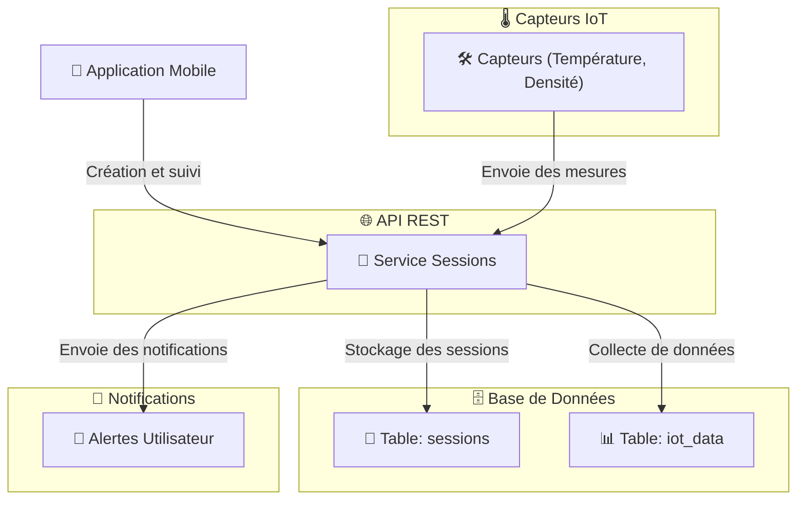

# 🍺 **Service de Gestion des Sessions de Brassage - Brasse-Bouillon**  

## 📌 **Introduction**  

Le **service de gestion des sessions de brassage** permet aux utilisateurs de planifier, suivre et enregistrer l’évolution de leurs brassages en cours.  

📌 **Objectifs du service :**  
✅ **Permettre aux brasseurs de planifier des sessions de brassage.**  
✅ **Associer une recette à une session de brassage.**  
✅ **Stocker l’historique des sessions avec les mesures de brassage (température, densité).**  
✅ **Notifier l’utilisateur en cas d’événements clés (fermentation terminée, températures anormales).**  

📌 **Technologies utilisées :**  

- **Express.js** (gestion des routes et API REST).  
- **Sequelize ORM** (manipulation des données SQL).  
- **Redis** (caching des sessions actives).  
- **WebSockets / MQTT** (communication en temps réel avec les capteurs IoT).  

---

## 📊 **Schéma d’Interaction du Service**

📌 **Illustration des flux de gestion des sessions de brassage.**  



---

## **🛠️ 1️⃣ Endpoints du Service**

📌 **Ce service expose les endpoints suivants :**  

| Méthode | Endpoint | Description | Authentification |
|---------|------------|-------------|----------------|
| **GET** | `/sessions` | Récupère toutes les sessions actives | ✅ Token |
| **GET** | `/sessions/:id` | Récupère une session spécifique | ✅ Token |
| **POST** | `/sessions` | Crée une nouvelle session de brassage | ✅ Token |
| **PUT** | `/sessions/:id` | Met à jour l’état d’une session | ✅ Token |
| **DELETE** | `/sessions/:id` | Supprime une session | ✅ Token |

📌 **Exemple d’appel API pour créer une session de brassage :**  

```bash
curl -X POST https://api.brasse-bouillon.com/sessions \
     -H "Authorization: Bearer {TOKEN}" \
     -H "Content-Type: application/json" \
     -d '{"recipeId": 1, "startTime": "2024-02-15T10:00:00Z"}'
```

📌 **Réponse attendue :**  

```json
{
  "id": 1,
  "recipeId": 1,
  "status": "en cours",
  "startTime": "2024-02-15T10:00:00Z"
}
```

---

## **🗄️ 2️⃣ Modèle de Base de Données**

📌 **Tables principales utilisées dans ce service :**  

### **Table `sessions`**

```sql
CREATE TABLE sessions (
    id SERIAL PRIMARY KEY,
    user_id INT REFERENCES users(id) ON DELETE CASCADE,
    recipe_id INT REFERENCES recipes(id) ON DELETE SET NULL,
    start_time TIMESTAMP DEFAULT CURRENT_TIMESTAMP,
    end_time TIMESTAMP,
    status VARCHAR(50) CHECK (status IN ('en cours', 'terminée', 'annulée')) NOT NULL
);
```

### **Table `iot_data`**

```sql
CREATE TABLE iot_data (
    id SERIAL PRIMARY KEY,
    session_id INT REFERENCES sessions(id) ON DELETE CASCADE,
    temperature FLOAT,
    gravity FLOAT,
    recorded_at TIMESTAMP DEFAULT CURRENT_TIMESTAMP
);
```

---

## **📡 3️⃣ Intégration avec les Capteurs IoT**

📌 **Ce service permet de recevoir des données des capteurs IoT (température, densité) pour suivre la fermentation.**  

📌 **Gestion des données IoT avec WebSockets :**  

```javascript
const WebSocket = require("ws");
const wss = new WebSocket.Server({ port: 8080 });

wss.on("connection", (ws) => {
    ws.on("message", (message) => {
        const data = JSON.parse(message);
        console.log("Données IoT reçues :", data);
    });
});
```

📌 **Exemple de message envoyé par un capteur :**  

```json
{
  "sessionId": 1,
  "temperature": 20.5,
  "gravity": 1.045,
  "recordedAt": "2024-02-15T14:30:00Z"
}
```

✅ **Pourquoi utiliser WebSockets ?**  
✔ **Mise à jour en temps réel des valeurs affichées sur l'application mobile.**  
✔ **Détection rapide des anomalies et envoi d’alertes aux utilisateurs.**  

---

## **📢 4️⃣ Gestion des Notifications**

📌 **Ce service envoie des notifications aux brasseurs en cas d’anomalies ou d’événements clés.**  

📌 **Exemple d’envoi d’une notification :**  

```javascript
const sendNotification = async (userId, message) => {
    await Notification.create({ user_id: userId, message });
    console.log(`Notification envoyée : ${message}`);
};

sendNotification(1, "Votre fermentation a atteint 20°C !");
```

📌 **Réponse attendue :**  

```json
{
  "id": 1,
  "userId": 1,
  "message": "Votre fermentation a atteint 20°C !",
  "sentAt": "2024-02-15T14:45:00Z"
}
```

✅ **Pourquoi utiliser des notifications ?**  
✔ **Avertir les brasseurs si la température dépasse un seuil critique.**  
✔ **Notifier lorsque la fermentation est terminée.**  

---

## **⚡ 5️⃣ Optimisation et Caching**

📌 **Mise en cache des sessions actives pour éviter des requêtes SQL répétées.**  

📌 **Exemple de mise en cache avec Redis :**  

```javascript
const redis = require("redis");
const client = redis.createClient();

const cacheMiddleware = (req, res, next) => {
    const key = req.originalUrl;
    client.get(key, (err, data) => {
        if (data) {
            return res.json(JSON.parse(data));
        }
        next();
    });
};

app.get("/sessions", cacheMiddleware, async (req, res) => {
    const sessions = await Session.findAll();
    client.setex(req.originalUrl, 3600, JSON.stringify(sessions)); // Cache pour 1h
    res.json(sessions);
});
```

✅ **Avantages du caching :**  
✔ **Réduction des temps de réponse**.  
✔ **Moins de charge sur la base de données**.  
