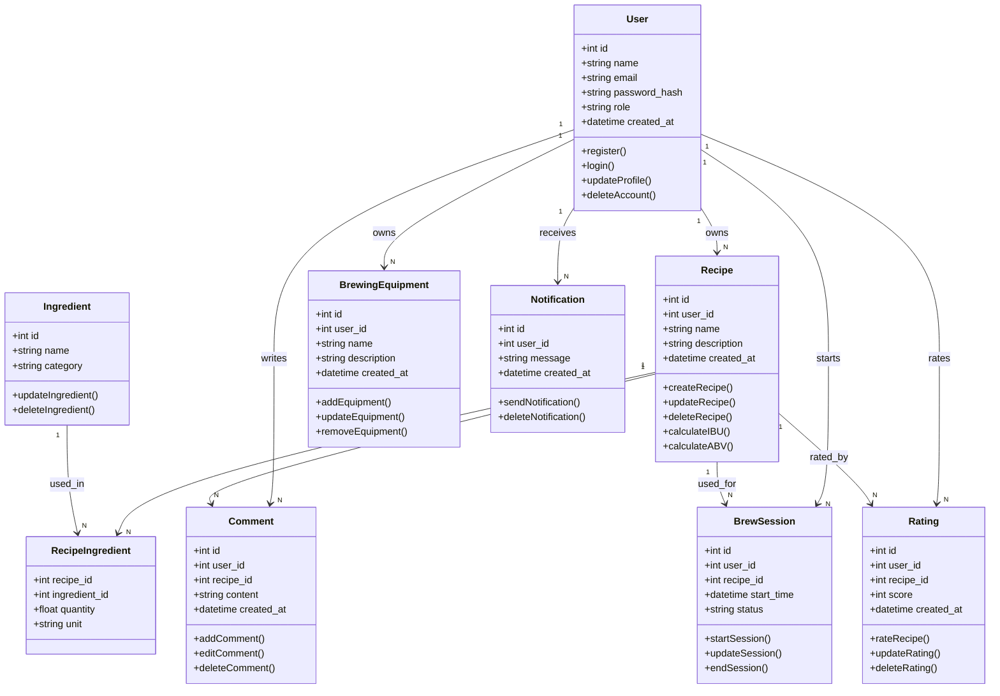

# Diagramme UML des Classes - Brasse-Bouillon

## 1. Introduction

Ce document présente le **diagramme UML des classes** du projet **Brasse-Bouillon**. Il illustre les principales classes, leurs attributs, méthodes et relations, suivant une approche orientée objet.

---

## 2. Analyse des Classes à Modéliser

L’analyse des classes s’appuie sur les entités définies dans **`data_model.md`** et les contraintes techniques décrites dans **`database_schema.md`**.

### 📌 **Liste des classes et attributs**

| Classe | Attributs | Méthodes |
|--------|----------|----------|
| **User** | `id: int`, `name: str`, `email: str`, `password_hash: str`, `role: str`, `created_at: datetime` | `register()`, `login()`, `updateProfile()`, `deleteAccount()` |
| **Recipe** | `id: int`, `user_id: int`, `name: str`, `description: str`, `created_at: datetime` | `createRecipe()`, `updateRecipe()`, `deleteRecipe()`, `calculateIBU()`, `calculateABV()` |
| **Ingredient** | `id: int`, `name: str`, `category: str` | `updateIngredient()`, `deleteIngredient()` |
| **RecipeIngredient** | `recipe_id: int`, `ingredient_id: int`, `quantity: float`, `unit: str` | - |
| **BrewSession** | `id: int`, `user_id: int`, `recipe_id: int`, `start_time: datetime`, `status: str` | `startSession()`, `updateSession()`, `endSession()` |
| **BrewingEquipment** | `id: int`, `user_id: int`, `name: str`, `description: str`, `created_at: datetime` | `addEquipment()`, `updateEquipment()`, `removeEquipment()` |
| **Comment** | `id: int`, `user_id: int`, `recipe_id: int`, `content: str`, `created_at: datetime` | `addComment()`, `editComment()`, `deleteComment()` |
| **Rating** | `id: int`, `user_id: int`, `recipe_id: int`, `score: int`, `created_at: datetime` | `rateRecipe()`, `updateRating()`, `deleteRating()` |
| **Notification** | `id: int`, `user_id: int`, `message: str`, `created_at: datetime` | `sendNotification()`, `deleteNotification()` |

### **Explications et Références**

- **Les classes `User`, `Recipe`, `Ingredient` et `BrewSession`** sont dérivées directement des entités de `data_model.md`.
- **Les classes `RecipeIngredient`, `Comment`, `Rating` et `Notification`** sont des objets liés permettant d’enrichir la logique métier de l’application.
- **Les méthodes sont définies en fonction des interactions utilisateurs et des processus identifiés dans `database_schema.md` et `api_interactions.md`**.

---

## 3. Diagramme UML des Classes

---

## 4. Alignement avec la Base de Données

- **Ce diagramme est cohérent avec `data_model.md` et `database_schema.md`**.
- **Il représente la structure orientée objet, tandis que `database_schema.md` montre l’implémentation en base MySQL**.

---
