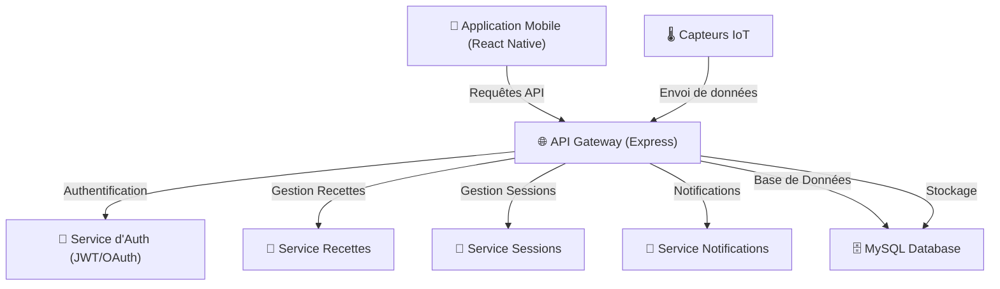

# Diagramme UML des Composants - Brasse-Bouillon

## 1. Introduction

Ce document présente le **diagramme UML des composants** du projet **Brasse-Bouillon**. Il illustre l'architecture technique en détaillant les interactions entre les principaux composants logiciels.

---

## 2. Documents de Référence

Ce diagramme a été construit en s’appuyant sur plusieurs documents d’architecture :

| Document | Rôle |
|------------|------------|
| **`architecture_overview.md`** | Décrit les composants du système |
| **`api_interactions.md`** | Liste les API exposées et leur usage |
| **`detailed_use_cases.md`** | Précise les fonctionnalités couvertes par chaque composant |
| **`data_model.md`** | Définit les entités et leurs relations |
| **`database_schema.md`** | Décrit la structure technique de la base de données |
| **`class_diagram.md`** | Montre comment les objets sont organisés |
| **`performance_optimization.md`** | Liste les optimisations techniques |
| **`security_architecture.md`** | Explique la gestion de la sécurité et des accès |

---

## 3. Vue d’Ensemble des Composants

Les principaux composants du système sont :

| Composant | Description | Rôle |
|-----------|------------|------|
| **Frontend (React Native)** | Interface utilisateur | Gère les interactions avec les utilisateurs |
| **Backend (Node.js + Express)** | Service central | Gère la logique métier et les requêtes API |
| **Base de Données (MySQL)** | Stockage persistant | Contient les recettes, utilisateurs, sessions... |
| **Service d’Authentification (JWT/OAuth)** | Sécurisation des accès | Gère les utilisateurs et leurs permissions |
| **Service de Notifications** | Envoi d’alertes et emails | Gère les rappels et notifications push |
| **Capteurs IoT** | Mesure en temps réel (température, densité) | Collecte et envoie des données au backend |

---

## 4. Diagramme UML des Composants

---

## 5. Explication des Interactions

| Interaction | Explication |
|------------|------------|
| **Frontend → Backend (API REST)** | L’application envoie des requêtes API pour récupérer ou modifier des données. |
| **Backend → Base de données** | L’API interroge et met à jour les informations stockées dans MySQL. |
| **Backend → Service d'authentification** | Vérification des identités et gestion des sessions via JWT/OAuth. |
| **Backend → Service de notifications** | Envoi d’alertes et de rappels aux utilisateurs. |
| **Capteurs IoT → Backend** | Transmission des relevés de température et densité pour suivi des brassins. |

---

## 6. Alignement avec l’Architecture Globale

Ce diagramme s'intègre avec les autres documents d'architecture :

| Document | Rôle |
|------------|------------|
| **`architecture_overview.md`** | Vue d’ensemble de l’architecture |
| **`api_interactions.md`** | Spécification des échanges entre services |
| **`detailed_use_cases.md`** | Précision des besoins fonctionnels |
| **`data_model.md`** | Structure conceptuelle des données |
| **`database_schema.md`** | Implémentation technique de la base de données |
| **`class_diagram.md`** | Définition des objets et relations |

---

## **Conclusion**

Ce document fournit une **vue détaillée des composants logiciels** de Brasse-Bouillon et de leurs interactions. Il constitue une **référence essentielle** pour le développement et l'évolution du projet.
