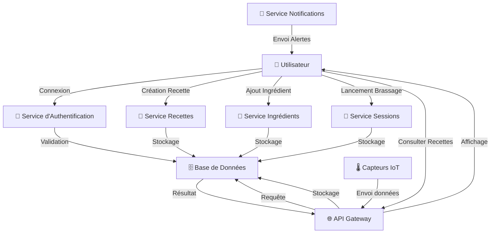

# Diagramme UML des Flux de Données - Brasse-Bouillon

## 1. Introduction

Ce document présente le **diagramme UML des flux de données** du projet **Brasse-Bouillon**. Il illustre comment les informations circulent entre les composants du système, assurant une gestion efficace des interactions entre les services et la base de données.

---

## 2. Documents de Référence

Ce diagramme a été construit en s’appuyant sur plusieurs documents d’architecture :

| Document | Rôle |
|------------|------------|
| **`component_diagram.md`** | Décrit les interactions entre les composants |
| **`api_interactions.md`** | Liste les API et leurs usages |
| **`database_schema.md`** | Spécifie l'implémentation MySQL et la gestion des données |
| **`data_model.md`** | Décrit la structure des données et leurs relations |
| **`detailed_use_cases.md`** | Fournit le contexte fonctionnel des flux d'information |
| **`class_diagram.md`** | Définit les classes et leurs attributs, impactant la gestion des données |

---

## 3. Vue d’Ensemble des Flux de Données

📌 **Les principaux flux de données du système sont :**  

| Flux de Données | Description | Source | Destination |
|----------------|------------|--------|------------|
| **Authentification** | Vérification des identifiants et gestion des sessions | **Frontend** | **Service d'Authentification** |
| **Création d’une recette** | Enregistrement d'une nouvelle recette | **Utilisateur (Frontend)** | **Backend → Base de données** |
| **Gestion des sessions de brassage** | Enregistrement et suivi des sessions | **Backend** | **Base de données** |
| **Ajout d’ingrédients** | Ajout d’un nouvel ingrédient à une recette | **Frontend** | **Backend → Base de données** |
| **Consultation des recettes** | Affichage des recettes | **Frontend** | **API REST → Base de données** |
| **Envoi de notifications** | Transmission des alertes utilisateur | **Service de Notifications** | **Frontend** |
| **Capteurs IoT** | Transmission des données de brassage | **Capteurs IoT** | **Backend → Base de données** |

---

## 4. Diagramme UML des Flux de Données

---

## 5. Explication des Flux

📌 **Analyse des principaux échanges de données** :  

| Interaction | Explication |
|------------|------------|
| **Utilisateur → Service d’authentification → Base de données** | Vérification des identifiants et gestion des sessions utilisateur. |
| **Utilisateur → API Gateway → Base de données** | Récupération des recettes stockées et affichage des résultats. |
| **Utilisateur → Service Recettes → Base de données** | Création et modification de recettes. |
| **Utilisateur → Service Sessions → Base de données** | Gestion des sessions de brassage et enregistrement des paramètres. |
| **Service de notifications → Utilisateur** | Envoi d’alertes et de rappels via API ou notifications push. |
| **Capteurs IoT → Backend → Base de données** | Transmission des relevés de température et suivi des brassages. |

---

## 6. Alignement avec l’Architecture Globale

📌 **Correspondance avec les autres documents d'architecture** :

| Document | Rôle |
|------------|------------|
| **`component_diagram.md`** | Décrit les interactions entre les services |
| **`api_interactions.md`** | Liste les API et leurs requêtes associées |
| **`database_schema.md`** | Définit les entités et leurs relations SQL |
| **`data_model.md`** | Présente la structure logique des données |
| **`class_diagram.md`** | Détaille les objets manipulés dans l’application |

---

## **Conclusion**

Ce document formalise les **flux d’informations** entre les services et assure une **meilleure compréhension de la gestion des données**.
