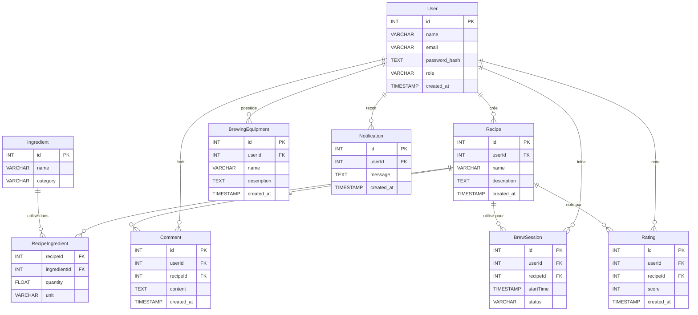

# Modèle de Données - Brasse-Bouillon

## 1. Introduction
Ce document présente le **modèle conceptuel et logique** des données utilisées dans l’application **Brasse-Bouillon**. Il définit les principales entités, leurs relations et leur rôle dans le système, indépendamment des détails d'implémentation dans MySQL.

---

## 2. Vue d’Ensemble du Modèle de Données

L'application repose sur un **modèle relationnel** structuré autour des principales entités métiers :

| Entité | Description |
|--------|------------|
| `User` | Représente les utilisateurs de l'application (brasseurs, administrateurs). |
| `Recipe` | Contient les recettes de brassage créées par les utilisateurs. |
| `Ingredient` | Gère les ingrédients disponibles pour les recettes. |
| `BrewSession` | Suivi des sessions de brassage associées aux utilisateurs et aux recettes. |
| `BrewingEquipment` | Contient les équipements utilisés pour le brassage. |
| `Comment` | Stocke les commentaires et avis laissés sur les recettes. |
| `Rating` | Notes attribuées aux recettes par les utilisateurs. |
| `Notification` | Gère les notifications envoyées aux utilisateurs. |

---

## 3. Diagramme UML du Modèle de Données

---

## 4. Explication des Relations

- **Un utilisateur peut créer plusieurs recettes** (`1-N`).
- **Un utilisateur peut avoir plusieurs sessions de brassage** (`1-N`).
- **Une recette peut contenir plusieurs ingrédients, et un ingrédient peut être utilisé dans plusieurs recettes** (`N-N`).
- **Un utilisateur peut écrire plusieurs commentaires et attribuer plusieurs notes à des recettes** (`1-N`).
- **Un utilisateur peut posséder plusieurs équipements de brassage** (`1-N`).
- **Un utilisateur peut recevoir plusieurs notifications** (`1-N`).

---

## 5. Différences avec `database_schema.md`

| Aspect | `data_model.md` (Conceptuel) | `database_schema.md` (Physique) |
|--------|-----------------------------|--------------------------------|
| **Objectif** | Définir les entités et relations métier | Décrire la structure technique de la base |
| **Niveau de détail** | Abstrait, sans dépendance SGBD | Détail des types et contraintes MySQL |
| **Audience cible** | Analystes, chefs de projet, devs | Développeurs, DBA |
| **Format** | Diagramme UML, explications | SQL DDL, tables et index |

---

## 6. Prochaines Étapes

- **Aligner le modèle conceptuel avec `database_schema.md` pour garantir la cohérence**.
- **Mettre à jour ce modèle si de nouvelles entités ou relations sont ajoutées.**

