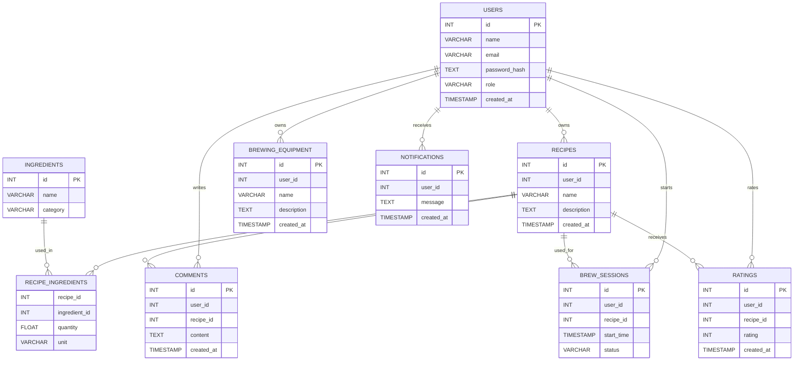

# Documentation du Schéma de Base de Données - Brasse-Bouillon

## 1. Introduction

Cette documentation décrit la structure de la base de données utilisée pour l’application **Brasse-Bouillon**. Elle comprend les principales entités, leurs relations et contraintes afin d’assurer la cohérence et la performance du stockage des données.

---

## 2. Vue d’Ensemble du Modèle de Données

La base de données repose sur un **modèle relationnel** structuré autour des principales entités métiers de l’application :

| Table | Description |
|--------|------------|
| `users` | Stocke les informations des utilisateurs (brasseurs, administrateurs). |
| `recipes` | Contient les recettes de brassage créées par les utilisateurs. |
| `ingredients` | Gère les ingrédients disponibles pour les recettes. |
| `recipe_ingredients` | Table pivot reliant les recettes aux ingrédients. |
| `brew_sessions` | Suivi des sessions de brassage des utilisateurs. |
| `brewing_equipment` | Contient les équipements utilisés pour le brassage. |
| `comments` | Stocke les commentaires et avis laissés sur les recettes. |
| `ratings` | Notes attribuées aux recettes par les utilisateurs. |
| `notifications` | Gère les notifications envoyées aux utilisateurs. |

---

## 3. Détails des Tables

### 3.1 `users`

📌 **Objectif** : Stocker les informations des utilisateurs.

| Colonne | Type | Contraintes |
|---------|------|------------|
| `id` | INT | PRIMARY KEY, AUTO_INCREMENT |
| `name` | VARCHAR(255) | NOT NULL |
| `email` | VARCHAR(255) | UNIQUE, NOT NULL |
| `password_hash` | TEXT | NOT NULL |
| `role` | ENUM('user', 'admin') | DEFAULT 'user' |
| `created_at` | TIMESTAMP | DEFAULT CURRENT_TIMESTAMP |

---

### 3.2 `recipes`

📌 **Objectif** : Contient les recettes de brassage.

| Colonne | Type | Contraintes |
|---------|------|------------|
| `id` | INT | PRIMARY KEY, AUTO_INCREMENT |
| `user_id` | INT | FOREIGN KEY → users(id) ON DELETE CASCADE |
| `name` | VARCHAR(255) | NOT NULL |
| `description` | TEXT | NULL |
| `created_at` | TIMESTAMP | DEFAULT CURRENT_TIMESTAMP |

---

### 3.3 `ingredients`

📌 **Objectif** : Contient les ingrédients utilisés dans les recettes.

| Colonne | Type | Contraintes |
|---------|------|------------|
| `id` | INT | PRIMARY KEY, AUTO_INCREMENT |
| `name` | VARCHAR(255) | NOT NULL |
| `category` | ENUM('hop', 'malt', 'yeast', 'water', 'additive') | NOT NULL |

---

### 3.4 `recipe_ingredients`

📌 **Objectif** : Associer les recettes à leurs ingrédients.

| Colonne | Type | Contraintes |
|---------|------|------------|
| `recipe_id` | INT | FOREIGN KEY → recipes(id) ON DELETE CASCADE |
| `ingredient_id` | INT | FOREIGN KEY → ingredients(id) ON DELETE CASCADE |
| `quantity` | FLOAT | NOT NULL |
| `unit` | VARCHAR(50) | NOT NULL |

---

### 3.5 `brew_sessions`

📌 **Objectif** : Suivi des sessions de brassage.

| Colonne | Type | Contraintes |
|---------|------|------------|
| `id` | INT | PRIMARY KEY, AUTO_INCREMENT |
| `user_id` | INT | FOREIGN KEY → users(id) ON DELETE CASCADE |
| `recipe_id` | INT | FOREIGN KEY → recipes(id) |
| `start_time` | TIMESTAMP | DEFAULT CURRENT_TIMESTAMP |
| `status` | ENUM('in_progress', 'completed', 'canceled') | DEFAULT 'in_progress' |

---

### 3.6 `brewing_equipment`

📌 **Objectif** : Contient les équipements utilisés pour le brassage.

| Colonne | Type | Contraintes |
|---------|------|------------|
| `id` | INT | PRIMARY KEY, AUTO_INCREMENT |
| `user_id` | INT | FOREIGN KEY → users(id) ON DELETE CASCADE |
| `name` | VARCHAR(255) | NOT NULL |
| `description` | TEXT | NULL |
| `created_at` | TIMESTAMP | DEFAULT CURRENT_TIMESTAMP |

---

## 4. Schéma UML du Modèle de Données

📌 **[À insérer] Diagramme UML représentant les relations entre les tables**

---

## 5. Contraintes et Optimisations

- **Utilisation de clés étrangères** pour assurer l’intégrité référentielle.
- **Indexation des colonnes fréquemment utilisées** pour améliorer la performance des requêtes.
- **Cascade Delete** sur les relations critiques (ex: `recipes` et `users`).

---
