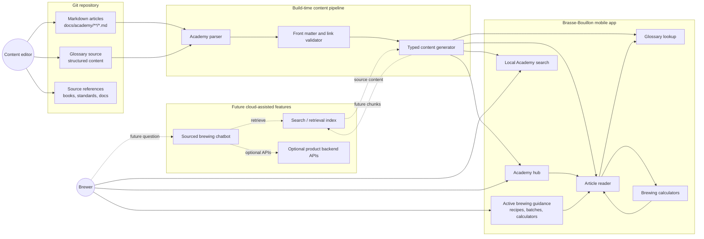

# Context diagram - Academy knowledge base

> **Feature**: Brewing Academy as a reference knowledge base.
> **Scope**: Mobile-first V1 with future chatbot path.

## Context

The app guides users through brewing workflows. The Academy answers deeper
questions raised by those workflows. The future chatbot is a conversational
interface over the same validated Academy and glossary corpus.

## Diagram

## Notes

- V1 does not require a backend for Academy content.
- V1 content is bundled/generated for mobile offline access.
- The future chatbot must cite generated article/glossary sources.
- App guidance remains separate from Academy reference content.
