# Use-case diagram - Academy knowledge base

> **Feature**: Academy reference content, mobile reader, glossary, search, and
> future chatbot.

## Context

The V1 user needs to find and read trusted brewing explanations. Future users
can ask a chatbot that answers from the same validated content.

## Diagram

```mermaid
flowchart LR
  Brewer(("Brewer"))
  Editor(("Content editor"))
  Reviewer(("Technical reviewer"))

  subgraph Academy ["Brasse-Bouillon Academy"]
    UC1(("Browse the Academy hub"))
    UC2(("Search a brewing concept"))
    UC3(("Filter by category or tag"))
    UC4(("Open an article"))
    UC5(("Read quick summary"))
    UC6(("Read detailed sections"))
    UC7(("Open glossary term"))
    UC8(("Open related calculator"))
    UC9(("Return from calculator to article"))
    UC10(("Open contextual Academy help from app flow"))
  end

  subgraph Editorial ["Editorial workflow"]
    UC11(("Create or edit Markdown article"))
    UC12(("Validate metadata and links"))
    UC13(("Review technical accuracy"))
    UC14(("Publish article"))
    UC15(("Deprecate obsolete article"))
  end

  subgraph FutureChatbot ["Future chatbot"]
    UC16(("Ask brewing question"))
    UC17(("Receive sourced answer"))
    UC18(("Open cited article section"))
    UC19(("Get no-answer when source is missing"))
    UC20(("Ask troubleshooting question"))
  end

  Brewer --> UC1
  Brewer --> UC2
  Brewer --> UC3
  Brewer --> UC4
  Brewer --> UC5
  Brewer --> UC6
  Brewer --> UC7
  Brewer --> UC8
  Brewer --> UC9
  Brewer --> UC10

  Editor --> UC11
  Editor --> UC12
  Reviewer --> UC13
  Editor --> UC14
  Editor --> UC15

  Brewer -. future .-> UC16
  Brewer -. future .-> UC17
  Brewer -. future .-> UC18
  Brewer -. future .-> UC19
  Brewer -. future .-> UC20
```

## V1 Boundary

V1 includes UC1 to UC15 for the pilot content slice.

UC16 to UC20 are modeled so the content design remains compatible with a future
sourced chatbot, but they are not implemented in the first refactor.

## Notes

- The hub must not hide the search function behind navigation.
- The reader must support quick comprehension and deep reference reading.
- Glossary and calculator links must be metadata-driven, not hardcoded per slug.
- Editorial validation should fail fast before content reaches the app bundle.
