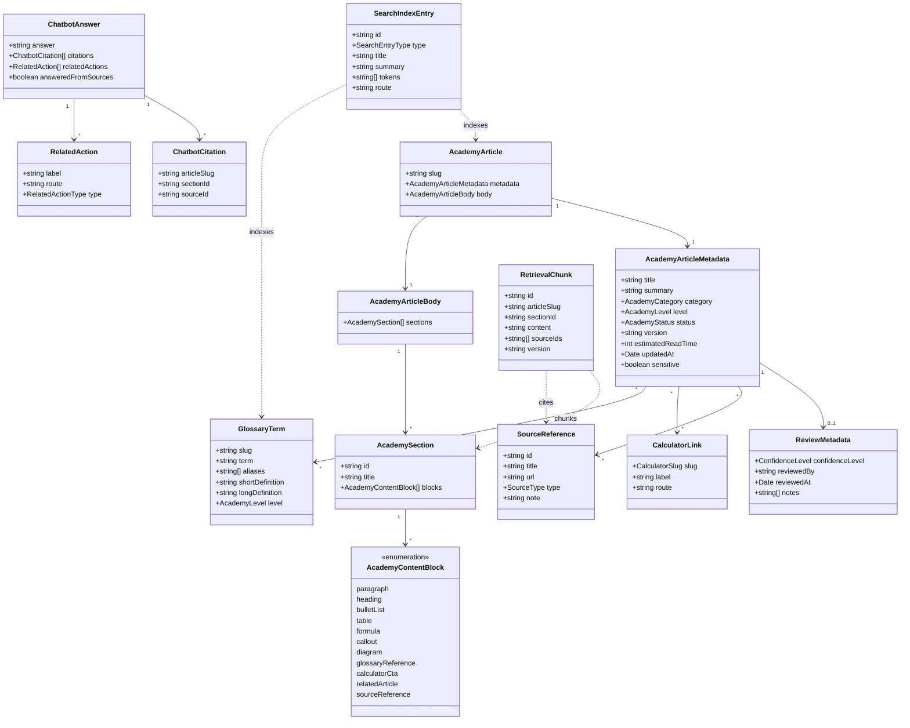
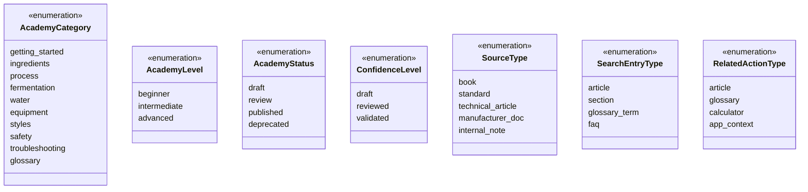

# Class diagram - Academy domain model

> **Feature**: typed Academy content, glossary, search, and future chatbot
> retrieval contracts.

## Context

This domain model is intentionally UI-agnostic. Presentation components render
these objects, but article meaning, metadata, links, sources, and search data do
not belong to React Native screens.

## Diagram

## Enumerations

## Notes

- `AcademyContentBlock` is a discriminated union in TypeScript.
- `RetrievalChunk` is generated for future chatbot retrieval, not manually edited.
- `ChatbotAnswer` is future-facing and must not drive V1 scope.
- `CalculatorLink` replaces slug convention-only wiring over time.
