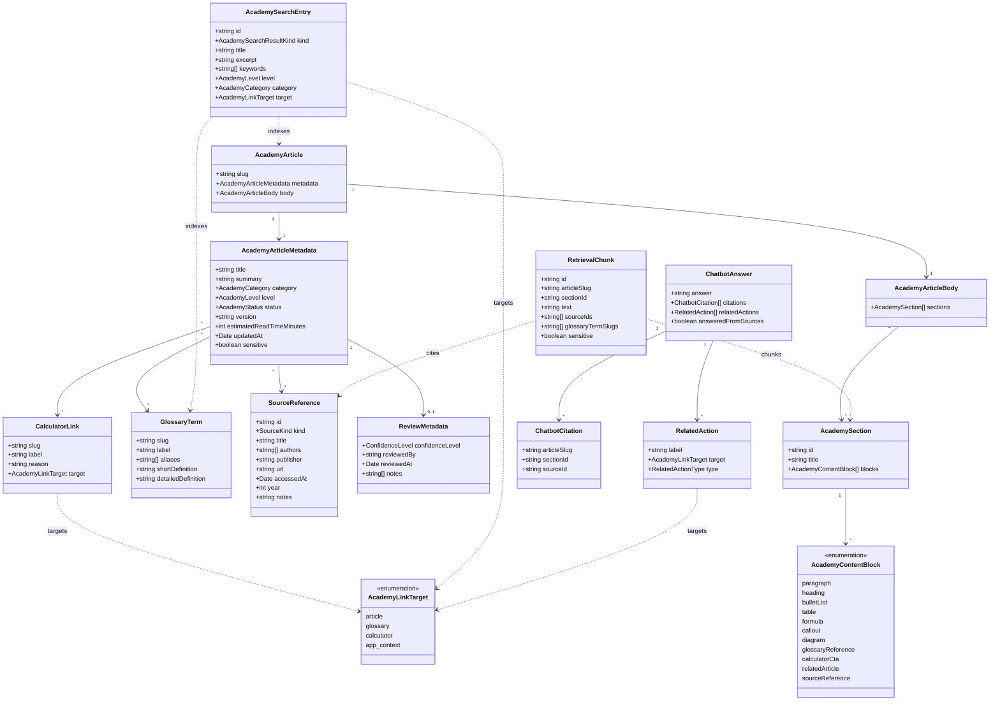
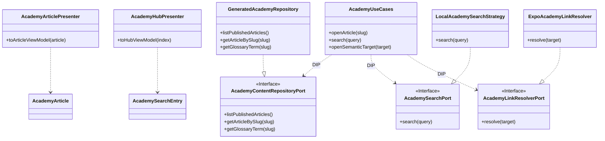
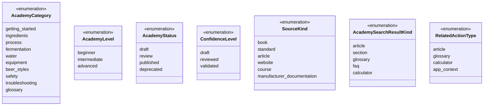

# Class diagram - Academy domain model

> **Feature**: typed Academy content, glossary, search, and future chatbot
> retrieval contracts.

## Context

This domain model is intentionally UI-agnostic. Presentation components render
these objects, but article meaning, metadata, links, sources, and search data do
not belong to React Native screens.

## Diagram

## SOLID-Oriented Application Contracts

## Enumerations

## Notes

- `AcademyContentBlock` is a discriminated union in TypeScript.
- Mermaid enumeration entries use underscore-safe labels where TypeScript
  literals may use hyphenated values, for example `beer_styles` maps to
  `'beer-styles'`.
- `RetrievalChunk` is generated for future chatbot retrieval, not manually edited.
- `ChatbotAnswer` is future-facing and must not drive V1 scope.
- `CalculatorLink` and search entries expose semantic targets, not concrete
  routes. Route mapping belongs to the link resolver.
- SOLID application contracts make Dependency Inversion explicit: use cases
  depend on ports, while generated repositories, search strategies, and route
  resolvers implement those ports.
- Single Responsibility is enforced by keeping presenters, repositories, search,
  and link resolution separate.
- Open/Closed is supported by content block discriminants and search/link
  strategy interfaces: new block renderers or search strategies should not
  require rewriting screens.
