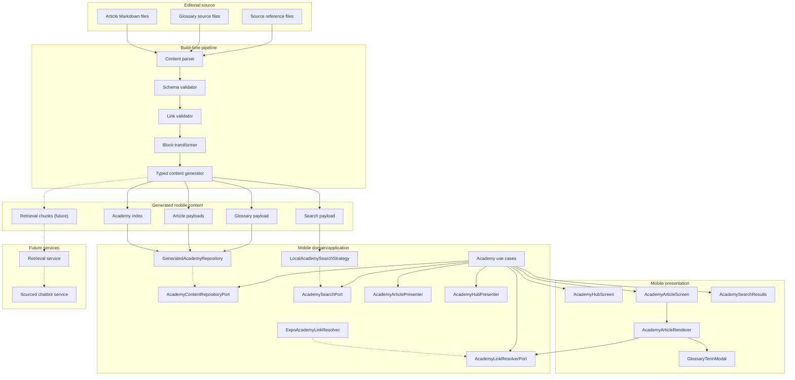

# Component diagram - Academy content architecture

> **Feature**: build-time content generation and mobile runtime consumption.

## Context

The V1 architecture separates authoring, validation, generated content, use
cases, and presentation. This prevents article text from returning to hardcoded
screen branches.

## Diagram

## Notes

- Generated files may be committed or generated in CI depending on the final
  implementation decision. The contract is the important point.
- Presentation components must not parse Markdown.
- Use cases must not know about raw Markdown paths.
- Future retrieval chunks are generated from the same validated content.
- SOLID is represented through explicit ports. `AcademyUseCases` depend on
  repository, search, and link resolver abstractions, not generated-file or
  Expo Router details.
- Presenters prepare screen view models so React Native components keep a narrow
  rendering responsibility.
- Search is modeled as a strategy so V1 local search can evolve without changing
  hub or article screens.

## Clean Architecture Layering

- Domain entities are represented by the contracts in the class diagram. They
  are not shown as framework components because they must remain independent.
- Application use cases depend on repository, search, and link resolver ports.
- Generated repositories, local search, and Expo route resolution are interface
  adapters implementing those ports.
- React Native screens and Expo Router are outer-layer details. They can depend
  on use cases and presenters, but use cases must not import screens or router
  APIs.
- The build-time pipeline is outside the mobile runtime. It produces data for
  adapters; it does not become part of the presentation layer.
