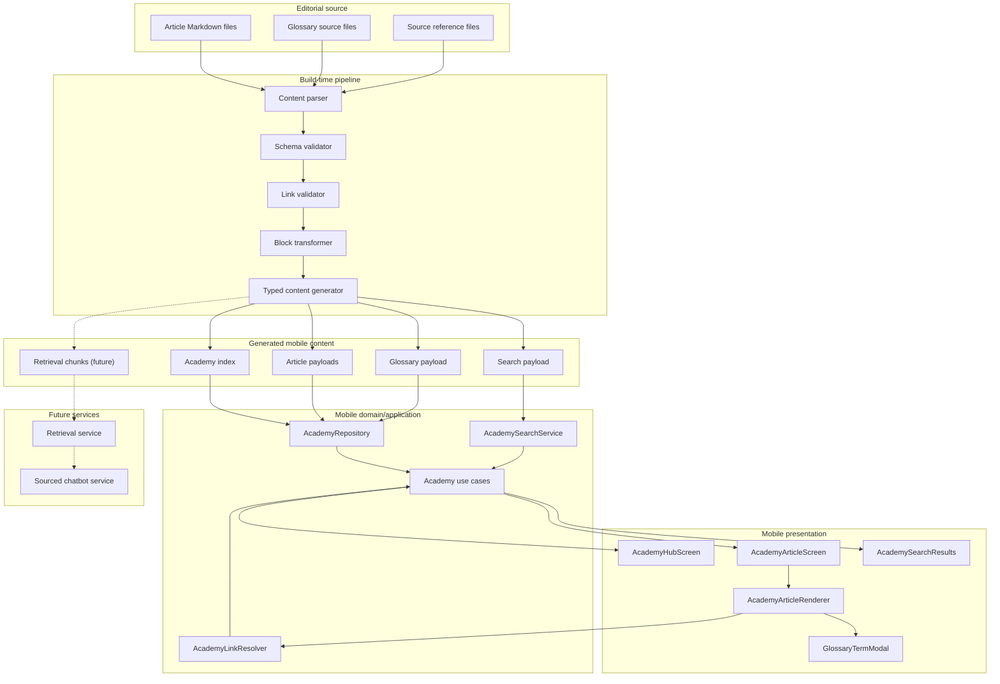

# Component diagram - Academy content architecture

> **Feature**: build-time content generation and mobile runtime consumption.

## Context

The V1 architecture separates authoring, validation, generated content, use
cases, and presentation. This prevents article text from returning to hardcoded
screen branches.

## Diagram

## Notes

- Generated files may be committed or generated in CI depending on the final
  implementation decision. The contract is the important point.
- Presentation components must not parse Markdown.
- Use cases must not know about raw Markdown paths.
- Future retrieval chunks are generated from the same validated content.
