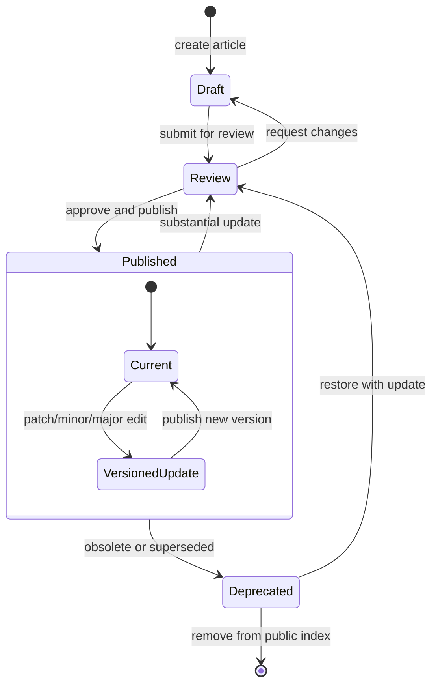

# State diagram - Academy article lifecycle

> **Feature**: Git-based editorial workflow with strict front matter status.

## Context

V1 keeps workflow lightweight but structured. It must remain compatible with
future technical and editorial reviews.

## Diagram

## Transition Rules

| Transition | Required checks |
|---|---|
| Draft -> Review | Required metadata, no broken internal links |
| Review -> Published | Sources present when technical/sensitive, review metadata updated |
| Published -> Review | Version change declared |
| Published -> Deprecated | Replacement article or deprecation note preferred |
| Deprecated -> Review | Content updated and re-reviewed |

## Notes

- `status` lives in front matter and drives generated visibility.
- `published` articles can ship in the mobile index.
- `draft` and `review` can be generated only for dev/test builds if needed.
- Sensitive content requires stronger source/review checks before publishing.
