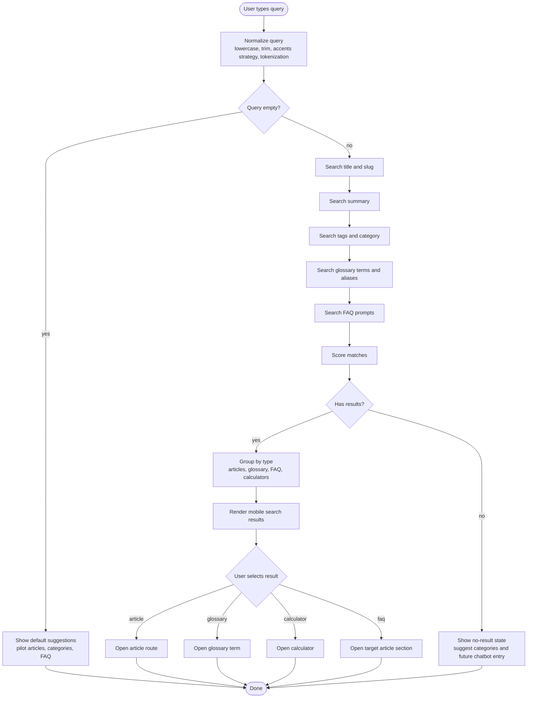

# Activity diagram - Academy local search

> **Feature**: V1 local search over generated Academy index and glossary.

## Context

V1 search should help a mobile user quickly find concepts, articles, FAQ items,
and glossary definitions. It is lexical and local. Full-text and semantic search
are future phases.

## Diagram

## V1 Ranking Rules

1. Exact title or glossary term match.
2. Exact alias match.
3. Tag/category match.
4. Summary match.
5. FAQ prompt match.

## Notes

- V1 search must not require network access.
- Results should be compact and thumb-friendly.
- Query logs must not be persisted by default.
- Future no-result flows can feed anonymized content-gap analysis only with a
  clear RGPD-compliant consent path.
