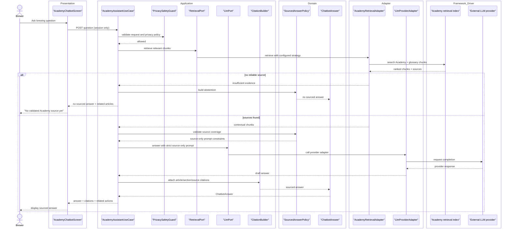

# Sequence diagram - future sourced chatbot RAG

> **Feature**: future Academy chatbot.
> **Status**: design target only, out of V1 implementation.

## Context

The chatbot should answer only from validated Academy and glossary content. If
the retrieval layer cannot find a reliable source, the chatbot should refuse to
answer affirmatively and suggest related reading.

## Diagram

## V1 Chatbot Constraints When Built

- No unsourced affirmative answers.
- No persistent conversation history by default.
- No user-specific brew data in the first assistant version.
- Sensitive topics require caution blocks.
- Answers should link back to article sections and glossary terms.
- Clean Architecture is shown because the future chatbot crosses UI,
  application policy, domain answer rules, retrieval/LLM adapters, and external
  providers.
- The use case depends on `RetrievalPort` and `LlmPort`, not directly on vector
  storage or LLM provider SDKs.

## Future Extensions

- V2: troubleshooting decision trees and guided diagnostics.
- V3: explicit-consent access to brew session, recipe, equipment, and
  measurements.
- Later: vector search if lexical retrieval is not enough.
