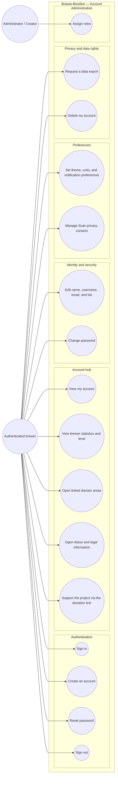

# Use-case diagram — account — authentication, profile, preferences, and privacy

> **Feature**: merged Account/Profile hub #644; profile completion #645/#836;
> RGPD deletion/export; consent ownership ADR-0003 and ADR-0012.
> **Scope**: mobile MVP target, with current implementation gaps explicitly
> recorded in the traceability matrix.

## Purpose

The Account screen is the user's self-service hub. It owns identity and
account preferences, while linking to the existing domain areas for brewer
statistics, equipment, shop, and application information. It must not become a
second dashboard or a second owner of Scan consent.

## Diagram

## Scope decisions

- **UC5** is the Profile/Account hub. The dashboard remains a separate
  operational surface and is not duplicated here.
- **UC6** reads existing batches, recipes, and scan sources. It computes the
  level in the application layer; no Profile-specific statistics endpoint is
  required for the MVP.
- **UC7** links to equipment, shop, and other domain screens. Those domains
  retain ownership of their data and use cases.
- **UC9** owns editable identity fields. The MVP adds a bounded plain-text bio
  and a text-only initials avatar; image upload is deferred.
- **UC11** stores local account preferences. Theme is global; units are
  displayed on the representative recipe ingredient surface while internal
  recipe calculations remain metric; notification switches are preference
  stubs until a delivery pipeline exists.
- **UC12** delegates to Scan's consent store. Account/Profile is a writer and
  reader, never a second consent source of truth; its history screen is
  read-only.
- **UC13** is implemented as an authenticated JSON export. The API owns the
  account and brewing-data projection; the mobile application merges its
  account-scoped preferences and consent history, writes a user-owned local
  file, and opens the native share sheet.
- **UC14** is a real destructive flow with a 30-day recovery window. It requires
  typed confirmation, stores the pending deletion server-side, and lets the
  authenticated user cancel before expiry. The expiry worker then follows
  ADR-0012: personal data is erased while public authored content is
  anonymized when required for lineage integrity.
- **Social/community profile surfaces, badges, public profile URLs, and
  authored-content lists are deferred.**

## Current implementation gaps

- The current login screen still uses the existing login/signup flow; the
  identifier-first sequence in `02-sequence-identifier-first.md` remains a
  separate future authentication slice.
- Account identity editing, password change, privacy settings, statistics,
  deletion, About navigation, and canonical legal links are implemented in the
  Profile worktree. The About screen also carries the Ko-fi support link as a
  plain outbound link per ADR-0028 — no in-app payment flow.
- Theme is persisted and applied across Profile and shared UI surfaces. Units
  are persisted and applied when displaying quantities on the representative
  recipe ingredient surface; internal recipe calculations remain metric. Export
  is available as a versioned JSON file assembled from API-owned data plus
  account-scoped local preferences and consent history. Consent history is
  exposed through a read-only screen backed by the canonical append-only store.
- The authenticated Profile flow uses `POST /auth/me/deletion` and
  `DELETE /auth/me/deletion` for the 30-day grace period. The hourly backend
  worker invokes the existing transactional erasure service for due accounts;
  public recipes are anonymized and private aggregates are purged.
