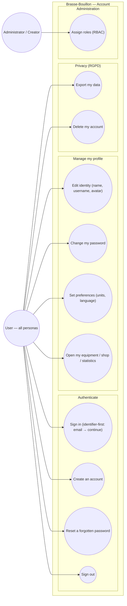

# Use-case diagram — account — auth, profile hub & RGPD

> **Feature**: identifier-first sign-in #1081; profile completion #645 #836;
> settings merge #644; RBAC CREATOR role #821.
> **Personas**: all (every user has an account); Léa (first sign-up must be easy).

## Context

Who interacts with account/identity and to do what: authenticate, manage the
profile hub, control privacy (RGPD). The profile becomes a hub (ux-refonte) so
secondary destinations (equipment, shop, stats, settings) are reached from here.
Grouped by domain; Mobile/API split in the component view; PII flows in
`06-data-flow.md`.

## Diagram

## Notes

- **UC1 identifier-first (#1081)**: the user enters email, taps "Continuer", and
  the app routes to password (account exists) or create-password (new). Removes
  the Connexion/Inscription tabs. The "exists?" check must be **enumeration-safe**
  (see `02-sequence`).
- **Profile hub (UC8)**: equipment / shop / statistics are reached *from* the
  profile (ux-refonte target); they are separate domains, linked here.
- **RGPD (UC9/UC10)**: data export + account deletion are first-class user
  rights (#645) — see the data-flow diagram for the PII involved.
- **RBAC (UC11)**: roles are USER / ADMIN / CREATOR (#821, CREATOR single-holder
  above ADMIN). Role assignment is an admin goal, distinct from self-service.
- **Demo mode**: typing the reserved demo credentials on UC1 enters demo mode
  (existing `isDemoTriggerCredentials`), not a real auth — a separate path.
