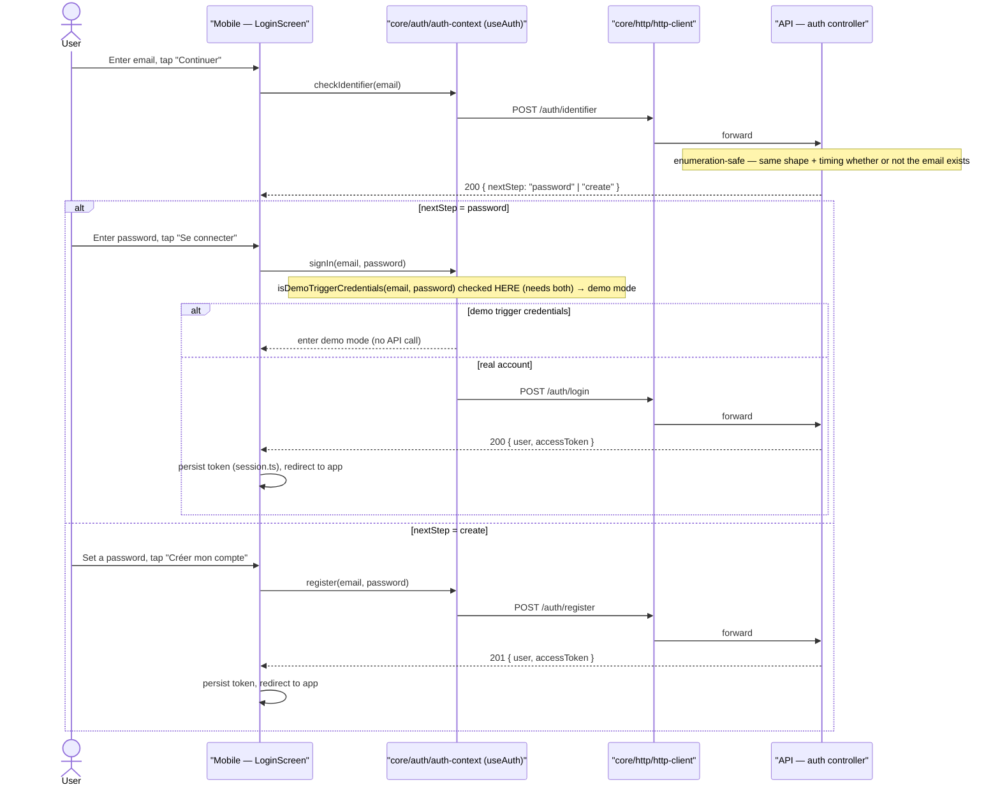

# Sequence diagram — account — identifier-first sign-in

> **Feature**: identifier-first sign-in #1081.
> **Source**: `LoginScreen.tsx`, `auth.api.ts`, `core/auth/session.ts`.

## Context

The #1081 "email d'abord" flow: the user enters an email, taps Continuer, and the
app routes to password (account exists) or create-password (new) — **without
leaking whether the email is registered** (enumeration-safe). Replaces the
tabs/Google/demo clutter. The demo-credentials shortcut is shown as the branch
that bypasses real auth.

## Diagram

## Notes / suggestions

- **Enumeration safety is the load-bearing requirement** (#1081): `/auth/identifier`
  must return an identical response shape **and** comparable timing for existing
  vs non-existing emails, otherwise it becomes an account-enumeration oracle. The
  routing decision (password vs create) is the only signal, and it is unavoidable
  for the UX — mitigate with rate-limiting + CAPTCHA-on-abuse rather than hiding
  it. **Suggested addition**: model the rate-limit/abuse path explicitly (a new
  use case "throttle repeated identifier checks") — currently absent.
- **Token storage**: `session.ts` persists the access token; **suggestion** —
  the diagram does not yet cover **refresh tokens / expiry**; if the API issues
  short-lived tokens, add a refresh sequence (see `05-state` note).
- **Demo branch** never calls the API — keep it strictly client-side.
- **OAuth (Google)**: currently cosmetic (#765). If it becomes real, it is a
  distinct sequence (provider redirect) — out of scope of #1081's first cut.
