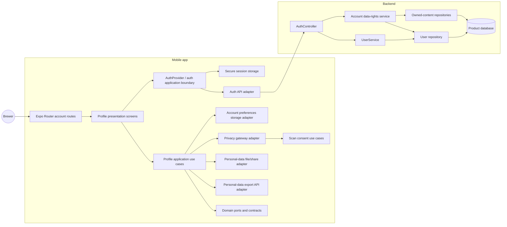

# Component diagram — account — Clean Architecture boundaries

> **Feature**: Account/Profile MVP. The diagram shows ownership and allowed
> dependencies, not navigation details.

## Dependency rules

- Presentation imports application contracts and UI primitives, never HTTP,
  storage, or backend DTOs.
- Application use cases depend on domain ports. They orchestrate workflows but
  do not know AsyncStorage, Expo Router, or TypeORM.
- Data adapters translate wire/storage formats into domain contracts.
- `PrivacyPreferencesGateway` delegates to Scan's consent owner; it must not
  reimplement consent persistence.
- `AuthProvider` owns session state and auth mutations. Profile screens call
  its public actions and do not duplicate token management.
- Backend controllers validate transport input and delegate business rules to
  services. Account deletion belongs to a dedicated data-rights service so the
  User CRUD service does not own anonymization policy.
- Dependencies point inward toward domain/application contracts. UI and HTTP
  details remain replaceable.
