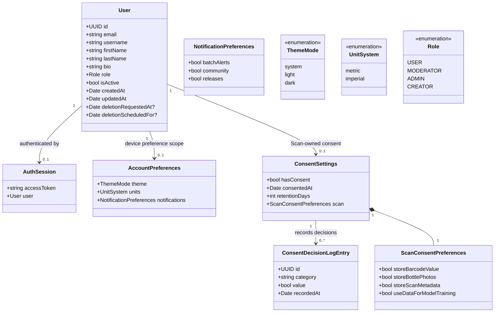

# Class diagram — account — identity, session, preferences, and consent

> **Feature**: Account/Profile MVP #644/#645/#836.
> **Source of truth**: current mobile/API contracts plus ADR-0003 and ADR-0012.

## Boundary decision

The MVP does not introduce a generic `Profile` table merely to hold fields
already owned by `users`. Identity fields remain on `User` and are exposed by
the authenticated `/auth/me` contract. Device-scoped preferences remain in a
mobile preference store until a backend synchronization contract is approved.
Scan consent remains owned by the Scan storage/application boundary.

## Ownership and persistence

| Concept                          | Owner                             | MVP persistence                         | Contract                             |
| -------------------------------- | --------------------------------- | --------------------------------------- | ------------------------------------ |
| Identity, email, username, bio   | API User module                   | Backend `users` row                     | `GET/PATCH /auth/me`                 |
| Access token and session         | Mobile auth boundary              | Secure session storage                  | `core/auth/session.ts`               |
| Theme, units, notification stubs | Mobile Profile boundary           | Local preference store                  | Profile application port             |
| Scan consent values and history  | Scan boundary                     | Local append-only consent log           | Profile gateway delegates to Scan    |
| Export bundle                    | API + mobile data-rights boundary | Local user-owned file                   | `GET /auth/me/export` + native share |
| Account deletion                 | API User/data-rights boundary     | Pending timestamps + expiry transaction | `POST/DELETE /auth/me/deletion`      |

## Invariants

- `bio` is optional, plain text, and bounded to 500 characters.
- `AccountPreferences` must not contain credentials or consent records.
- Profile screens do not import AsyncStorage, HTTP clients, or Scan storage
  directly; they use application ports/use cases.
- Consent writes are timestamped and delegated to one owner.
- Deletion scheduling is idempotent and authenticated — a repeat request
  returns the existing schedule even past its deadline, never a new one;
  cancellation is allowed before expiry only; final erasure is transactional,
  re-checks due-ness on the worker path, and never returns password hashes or
  other sensitive implementation fields.
- Public authored content that has external lineage is anonymized rather than
  hard-deleted, per ADR-0012.
- The `CREATOR` role remains an administration concern and cannot be assigned
  through self-service Profile flows.
