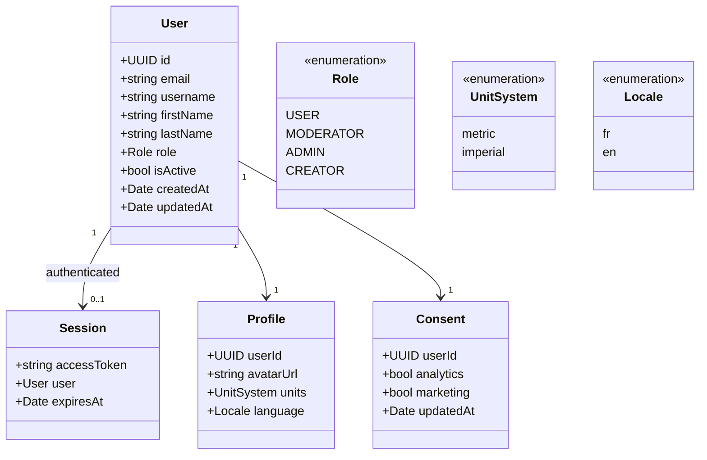

# Class diagram — account — identity, session, preferences, consent

> **Feature**: profile completion #645 #836; RBAC #821; identifier-first #1081.
> **Source**: `features/auth/domain/auth.types.ts`, `core/auth/session.ts`.

## Context

The identity model: User + Session (today), extended with the profile/preferences
and RGPD-consent the completion epics add (#645/#836). Fields beyond today's
`User` are flagged as additions to confirm before migration.

## Diagram

## Notes / suggestions

- **Today** (`features/auth/domain/auth.types.ts`) the `User` is
  `id/email/username/firstName?/lastName?/role:string/isActive/createdAt/updatedAt`;
  `AuthSession` = `accessToken` + `user`. `Profile`, `Consent`, `expiresAt`, and
  the typed enums are the **#645/#836 additions** — flagged, not assumed.
- **`Role` enum**: the API enum today is `USER / MODERATOR / ADMIN`
  (`packages/api/src/common/enums/role.enum.ts`); **`CREATOR` is planned (#821)**,
  not yet in the enum. Promote the mobile `string` role to the typed enum.
  **Suggestion**: capture the CREATOR-uniqueness invariant (single-holder above
  ADMIN) in an ADR — a structural rule, not just data.
- **`Locale` ties to the bilingual FR/EN epic** (#512): the language preference
  here is the per-user override of the app default — coordinate with the i18n
  chantier so there is one source of truth for locale.
- **`Consent`** is the RGPD backbone (cookie/analytics/marketing opt-ins). The
  website already gates analytics on consent; **suggestion** — align the mobile
  consent model with the website's so a user's choice is coherent across surfaces.
