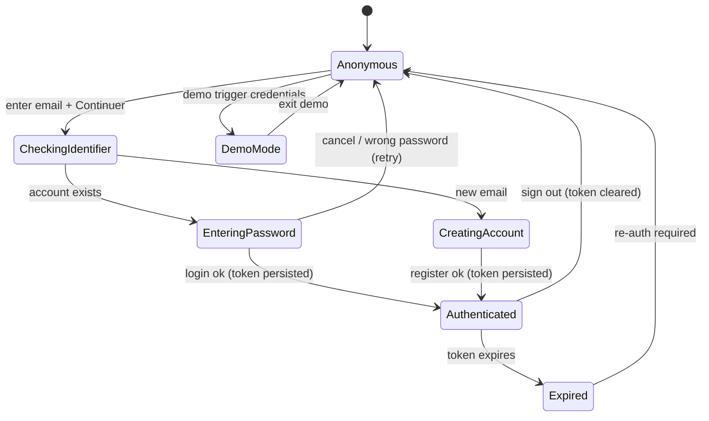

# State diagram — account — session lifecycle

> **Feature**: auth/session (`core/auth/session.ts`); identifier-first #1081.

## Context

The app's authentication state, from anonymous to authenticated, including the
demo-mode branch and token expiry. Drives the `(auth)` vs `(app)` route guard
(redirects in `app/(auth)/_layout.tsx` and `app/(app)/_layout.tsx`).

## Diagram

## Notes / suggestions

- **Route guard**: `Anonymous`/`Expired` → `(auth)/login`; `Authenticated`/
  `DemoMode` → `(app)`. The guard already exists; this names the states it keys on.
- **`Expired` is a suggested addition**: today `session.ts` persists a token with
  no modelled expiry. **Suggestion** — if the API issues short-lived JWTs, add a
  silent-refresh transition (`Authenticated → Refreshing → Authenticated`) and a
  fallback to `Expired`; if tokens are long-lived, document that explicitly so the
  absence of refresh is a decision, not an oversight.
- **DemoMode** is a parallel, token-less state — it must never hit authenticated
  API routes (it reads demo data via the data-source toggle).
