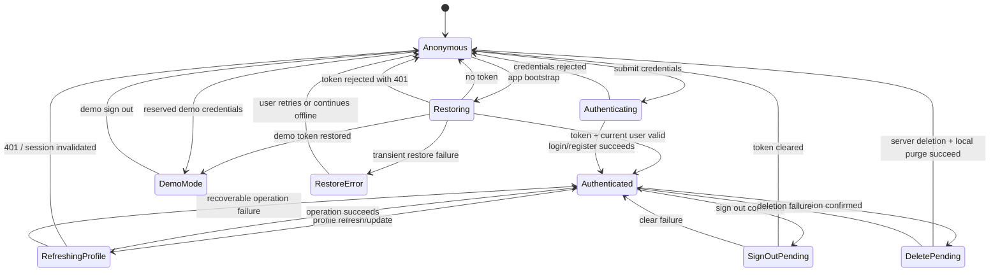

# State diagram — account — session and destructive-flow lifecycle

> **Feature**: `core/auth/session.ts`, AuthProvider, Profile account actions.

## Session state

## State rules

- `AuthProvider` exposes `session: null` until bootstrap completes, preventing
  the app router from rendering an authenticated surface prematurely.
- A live-session 401 clears the local token and session. Demo mode never calls
  live authenticated endpoints and is not purged by the live 401 handler.
- Profile mutation states are local to the relevant screen for button-level
  duplicate-submit protection; `AuthProvider.isLoading` remains the shared
  auth-operation state.
- Delete confirmation is a separate UI state from `DeletePending`. The
  destructive request cannot start without typed username confirmation.
- A future refresh-token state is intentionally not modelled: the current API
  contract exposes access-token persistence plus 401 invalidation only. It must
  be added as a separate authentication design before implementation.
