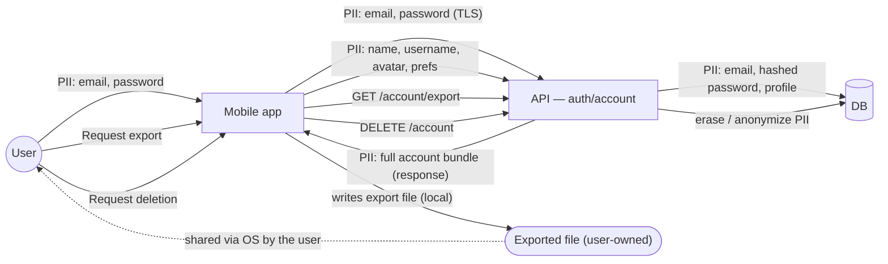

# Data-flow diagram — account — PII & RGPD

> **Feature**: profile + RGPD export/delete #645 #836.
> **Related**: ADR/privacy policy; website consent model (parity).

## Context

Where personal data flows in the account domain, so a privacy review cannot be
skipped. Every PII-bearing edge is annotated. Covers sign-in, profile edit, and
the RGPD export/delete rights.

## Diagram

## Notes / suggestions

- **Passwords**: never stored in clear — hashed server-side (annotate the DB edge
  as `hashed`). The app holds the password only transiently during sign-in.
- **Export (RGPD art. 20 portability)**: the bundle is PII — it must be delivered
  over an authenticated channel and is then user-owned (OS share). **Suggestion**:
  define the export format (JSON?) and whether it includes recipes/batches (likely
  yes — user content) in the #645 spec; currently unspecified.
- **Deletion (RGPD art. 17)**: decide **erase vs anonymize** for content the user
  authored that others may have cloned (public recipes). **Suggestion** —
  anonymize authored public recipes (keep the lineage, drop the identity) rather
  than hard-delete, to avoid breaking others' clones; capture this in an ADR.
- **Consent parity**: the website gates analytics on consent (PR #817 removed
  GA4). **Suggestion** — the mobile `Consent` model should mirror the website's
  categories so a user's privacy choices are coherent across surfaces.
- **No third-party PII egress** in scope: no analytics/marketing SDK receives PII
  unless consent is granted (and none is wired today).
