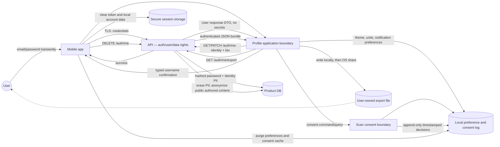

# Data-flow diagram — account — PII, consent, export, and deletion

> **Feature**: Profile + RGPD rights #645/#836.
> **Policies**: ADR-0003 (consent single source of truth), ADR-0012
> (anonymize authored public content on deletion).

## Target flow

## Endpoint contract status

| Flow                     | Target contract                 | Current implementation                              | Gate                                      |
| ------------------------ | ------------------------------- | --------------------------------------------------- | ----------------------------------------- |
| Read identity            | `GET /auth/me`                  | Available                                           | None                                      |
| Update identity          | `PATCH /auth/me`                | Available; bio migration pending                    | Add bounded bio field                     |
| Change password          | `POST /auth/me/change-password` | Available                                           | None                                      |
| Read export              | `GET /auth/me/export`           | Available; mobile merges local data and shares JSON | Keep schema versioned and exclude secrets |
| Request deletion         | `POST /auth/me/deletion`        | Available; 30-day pending state                     | Keep expiry worker operational            |
| Cancel deletion          | `DELETE /auth/me/deletion`      | Available before expiry                             | Reject cancellation after due time        |
| Execute deletion         | Internal expiry worker          | Available; transactional erasure/anonymization      | Monitor scheduled job                     |
| Scan consent and history | Existing Scan storage/use cases | Available in the Scan boundary                      | Profile must delegate, not duplicate      |

## Privacy rules

- Passwords are sent only over TLS and are hashed before persistence. They are
  never part of the export bundle or a response DTO.
- Identity PII is owned by the API User module. The Profile UI never persists
  credentials or directly accesses the database.
- Consent values use one owner. The Profile privacy screen may present and
  update them through the Scan gateway, while the audit record is appended by
  the consent boundary.
- Export is authenticated and user-owned after local creation. The API returns
  a documented, versioned JSON schema for account and owned aggregate data;
  mobile adds local preferences and consent history before writing the file.
- Deletion scheduling is idempotent and cancellable during the 30-day grace
  period. Final deletion must be atomic and idempotent. Private user-owned data
  is erased; public authored content with dependent lineage is anonymized as
  `Auteur supprimé`, per ADR-0012.
- A failed deletion must leave the authenticated local session intact and show
  an actionable error. A successful deletion must clear session and local
  account-scoped caches.
