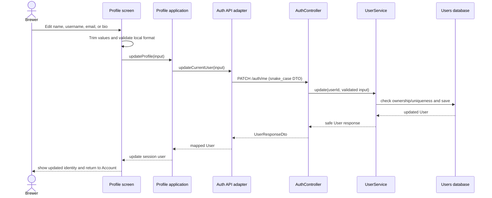
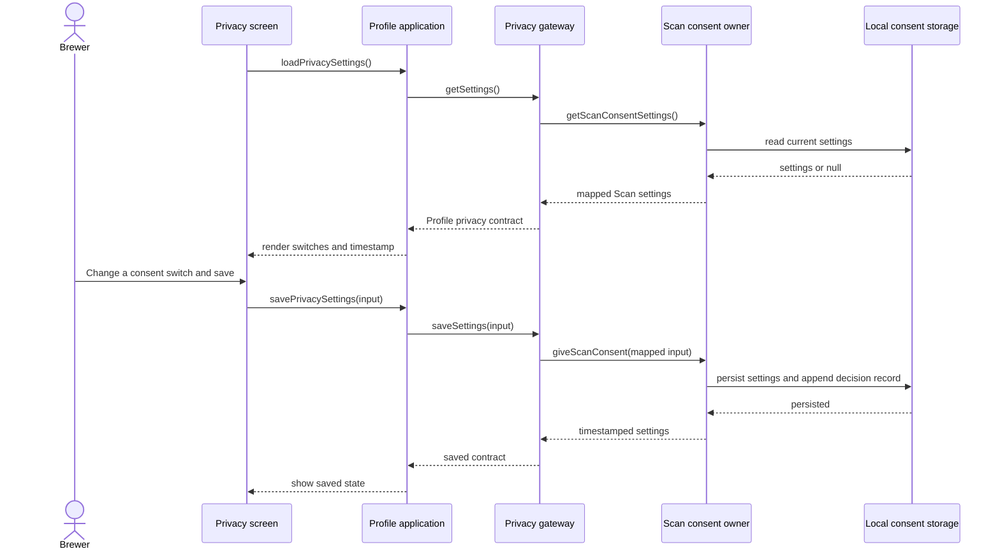

# Sequence diagram — account — edit profile and manage preferences

## Edit identity

## Privacy preferences

## Failure rules

- Local validation prevents an invalid identity request from reaching the API.
- A uniqueness or validation error is displayed without losing form state.
- A privacy-storage failure leaves the current switches visible and does not
  navigate away.
- Each screen disables its save action while its request is pending.
