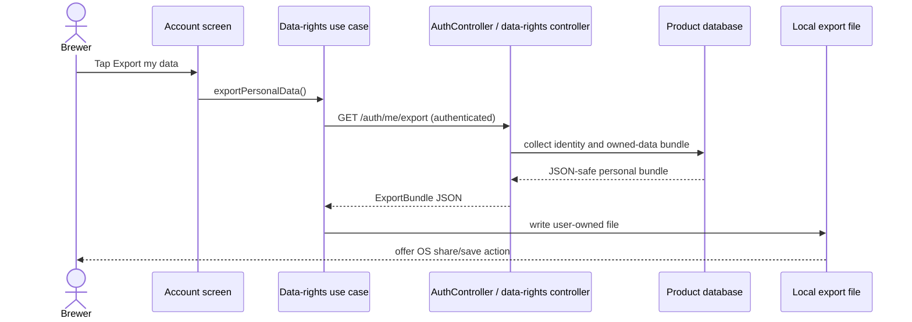

# Sequence diagram — account — export and deletion rights

## Export request



The mobile export is complete only after the API bundle has been received, the
local account-scoped data has been merged, the JSON file has been written, and
the native share sheet has opened. Any failure keeps the user on the screen and
does not advertise a successful export.

## Account deletion

```mermaid
sequenceDiagram
  actor U as Brewer
  participant S as Delete account screen
  participant UC as Data-rights use case
  participant API as AuthController / data-rights controller
  participant DRS as AccountDeletionService
  participant DB as Product database
  participant Session as Secure session storage
  participant Local as Account-scoped local storage

  U->>S: Open destructive action
  S-->>U: Explain 30-day grace period and consequences
  U->>S: Type exact username
  S->>S: Enable delete only on exact match
  U->>S: Confirm deletion request
  S->>UC: requestAccountDeletion()
  UC->>API: POST /auth/me/deletion
  API->>DRS: requestDeletion(userId)
  DRS->>DB: store requested_at + scheduled_for
  API-->>UC: scheduled_for + grace_period_days
  UC-->>S: pending deletion state
  U->>S: Cancel before expiry
  S->>UC: cancelAccountDeletion()
  UC->>API: DELETE /auth/me/deletion
  API->>DRS: cancelDeletion(userId)
  DRS->>DB: clear pending timestamps
  API-->>UC: canceled
  loop Hourly expiry job
    DRS->>DB: find due pending accounts
    DRS->>DRS: deleteAccount(userId, dueAt)
    Note over DRS,DB: due-ness is re-checked inside the erasure transaction;<br/>a canceled or rescheduled account is skipped and<br/>one failed account never blocks the others
  end
  DRS->>DB: transaction: erase PII and private data
  DRS->>DB: anonymize public authored content where lineage requires it
  DB-->>DRS: committed, idempotent result
  DRS-->>API: success
  API-->>UC: success
  UC->>Session: clear access token
  UC->>Local: purge account-scoped caches and preferences
  UC-->>S: signed-out state
  S-->>U: return to authentication screen
```

## Failure and safety rules

- A confirmation mismatch never calls the API.
- A pending deletion exposes only the cancellation action; a second schedule
  request is idempotent — including when the deadline has already passed, so a
  re-request can never reopen the closed cancellation window.
- Cancellation is rejected once the deadline has passed; the expiry worker
  re-checks due-ness inside the erasure transaction, so a cancellation that
  wins the race is honored.
- A server failure preserves the local session and shows the error.
- The server operation is authenticated, transactional, and idempotent.
- The client clears local account state only after the server confirms success.
