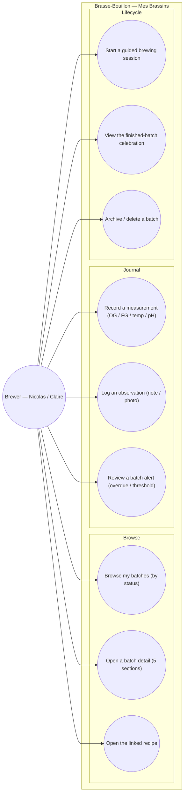

# Use-case diagram — batches — "Mes Brassins" journal

> **Feature**: epic #595 (Mes Brassins detail rewrite); #605 (data model),
> #606 (5-section detail), #607 (measurement/observation entry), #608 (step state).
> **Related**: the live guided execution is the sibling brewing-session
> conception (PR #1096) — this feature is the **journal / management** around batches.
> **Personas**: Nicolas (track & compare batches), Claire (document experiments).

## Context

Who manages brewing batches and to do what. This is the brewer's **journal**:
browse batches, read the 5-section detail, record measurements/observations
(including after the fact), review alerts, and close out. The live step-by-step
execution (start/complete/pause a step, timers, tips) is a distinct feature
(`brewing-session/01-use-case.md`) reached via UC "Start a guided session".
Grouped by domain (Batches). Mobile/API split is not here.

## Diagram

## Notes

- **Boundary with brewing-session**: UC7 hands off to the guided-execution
  feature (its own use cases). UC4/UC5 here are *journal* entries — recordable
  any time (retrospective logging), whereas the same data captured *during* a
  live step is modelled in `brewing-session/02-sequence`.
- **5-section detail (UC2, #606)**: Identity / Plan / Live-history / Measurements
  / Notes — a presentation grouping over the batch aggregate (class diagram).
- **UC8 celebration** is the existing `BatchFinishedScreen`, reached when the
  batch reaches `completed` (today demo-gated; production surfacing is the
  journey-3/4 gap from the ux-refonte study).
- **Triggers reframed**: an overdue/threshold alert is a system event; the use
  case is UC6 *review* an alert (brewer pulls), not "be notified".
