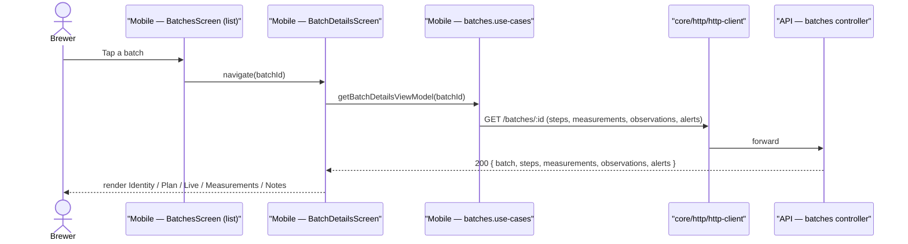
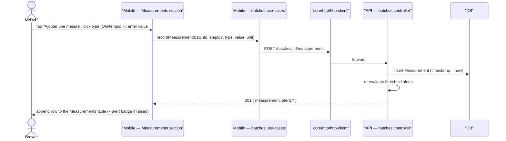

# Sequence diagram — batches — open detail & record a measurement

> **Feature**: 5-section detail #606; measurement entry #607.
> **Source**: mobile `features/batches` + API `batches` module.

## Context

Two journal interactions: loading the 5-section batch detail, and recording a
measurement from the Measurements section (retrospective entry, any time — not
necessarily mid-live-step). The live-step start/complete flow is in
`brewing-session/02-sequence`.

## Open the 5-section detail

## Record a measurement

## Notes

- **Egress**: screen → use-case → `core/http/http-client`; no direct `fetch`.
- **`getBatchDetailsViewModel`** already exists (assembles recipe name + steps);
  the rewrite extends it to also fetch measurements/observations/alerts for the
  5 sections.
- **Alert re-evaluation** happens server-side on measurement insert (threshold
  breach) — the brewer then *reviews* it (use-case UC6), it is not pushed.
- **Demo mode**: use-cases mutate the in-memory demo batch (existing pattern).
