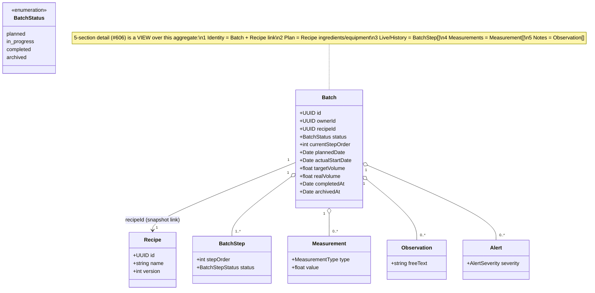

# Class diagram — batches — the batch aggregate & 5-section view

> **Feature**: epic #595; data model #605; 5-section detail #606.
> **Shared entities**: `Measurement`, `Observation`, `Alert`, `BatchStep` are
> detailed in the sibling brewing-session conception (PR #1096 →
> `docs/architecture/diagrams/brewing-session/04-class.md` once merged) — not
> redrawn here.

## Context

The Batch aggregate as the journal sees it, and how the 5 detail sections (#606)
project over it. The live-execution entities (steps, measurements, observations,
alerts) are owned by the brewing-session class diagram; this one shows the batch
root, its recipe link, and the section grouping so the detail-screen rewrite has
a structural map.

## Diagram

## Notes

- **The 5 sections are presentation, not new entities** — the `note` maps each
  section to the underlying data. Keeping that explicit prevents the rewrite
  from inventing parallel models.
- **`recipeId` is a snapshot link**: the batch references the recipe it was
  started from, but its step list is copied at start (see brewing-session) so a
  later recipe edit/fork does not mutate a recorded batch.
- **`BatchStatus`** today is only `in_progress`/`completed` (mobile
  `batch.types.ts`); **`planned` + `archived` are the #595/#605 additions** that
  the lifecycle (`05-state`) introduces — flagged, confirm before migration.
  `archivedAt` is the matching new timestamp (for UC9 archive).
- **Entity field detail** (Measurement/Observation/Alert columns, enums) lives in
  the sibling brewing-session class diagram (PR #1096) — single source, cross-referenced.
