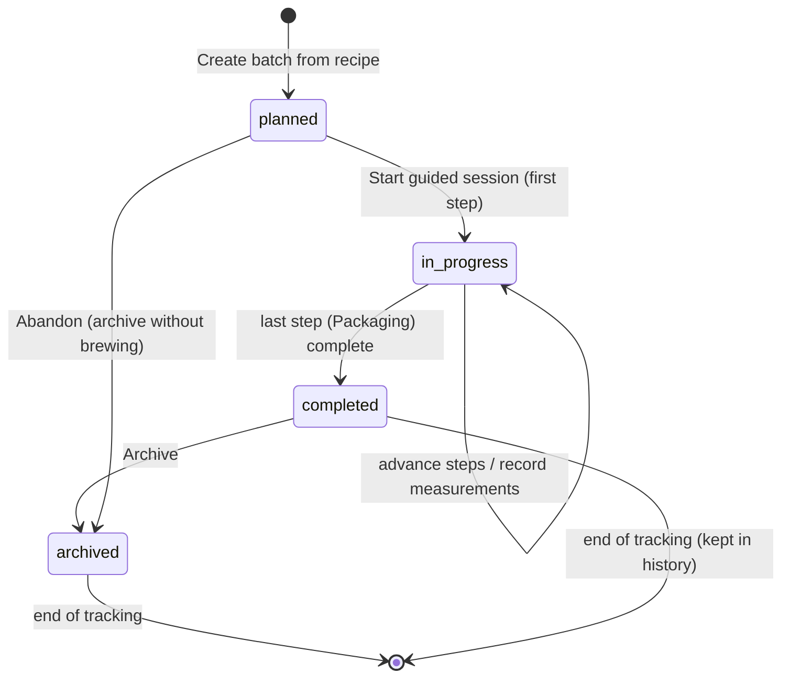

# State diagram — batches — batch lifecycle (journal view)

> **Feature**: epic #595; status model (#605).
> **Related**: the per-step state machine is the sibling brewing-session
> conception (PR #1096 → `diagrams/brewing-session/05-state-batch-step.md`).

## Context

The batch's overall lifecycle as the journal tracks it, from planned to archived.
This is coarser than the per-step machine (which drives the live execution); it
is what the list status badge and the Identity-section status reflect.

## Diagram

## Notes

- **`planned`** is a journal state (a batch created/scheduled but not started);
  today's model collapses to `in_progress`/`completed` — adding `planned` +
  `archived` is the #595/#605 enrichment, confirm at migration.
- **`completed`** opens the celebration (`BatchFinishedScreen`) and unlocks
  bottling/label (journey 4). The transition is driven by the last step
  completing (see per-step machine).
- **`archived`** (UC9) hides a batch from the active list without deleting its
  journal — distinct from hard delete (which cascades satellites).
- The fine-grained `paused`/`skipped` step states are NOT batch states — they
  live on `BatchStep` (`brewing-session/05`). Keeping the two levels separate
  avoids conflating "this step is paused" with "this batch is in progress".
