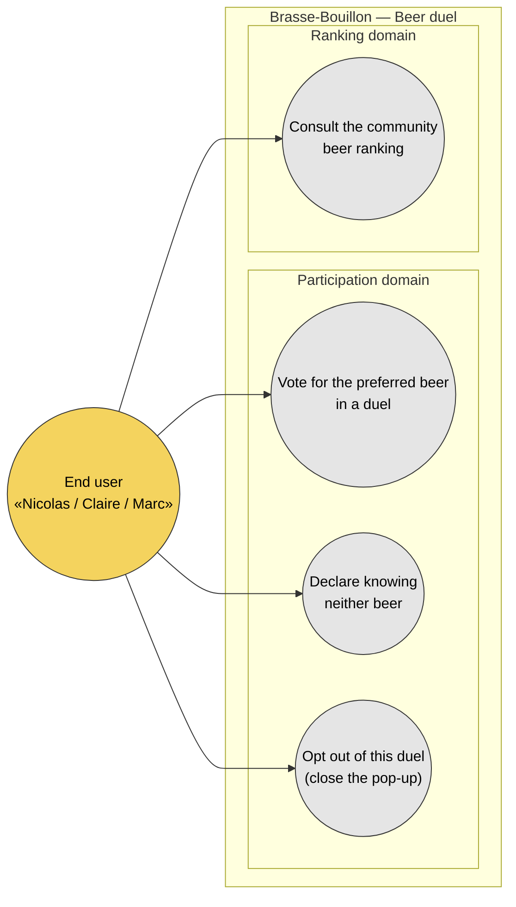

# Use case diagram — beer-duel — actors and goals

> **Feature**: epic `epic(beer-duel)` — community beer preference ranking via pairwise duels.
> **Source specs**: [`docs/architecture/specs/beer-duel.md`](../../specs/beer-duel.md) §2 (why pairwise) and §3 (canonical rules).
> **Related ADRs**: [ADR-0005](../../decisions/0005-backend-split-encyclopedia-vs-product.md), [ADR-0009](../../decisions/0009-beer-duel-preference-data-ownership.md).
> **Companions**: [02-sequence-vote.md](02-sequence-vote.md), [03-component.md](03-component.md), [04-class.md](04-class.md), [05-state-duel-session.md](05-state-duel-session.md), [06-data-flow.md](06-data-flow.md).

## Context

Highest-level view of **who interacts with the beer-duel feature and to do what**.

This diagram answers *"who wants what?"*. It deliberately does **not** show:

- **Backend structural decomposition** (Mobile / NestJS split) — that lives in the [03 component diagram](03-component.md).
- **Temporal flow** (login → pop-up → vote → Elo update) — see [02 sequence](02-sequence-vote.md).
- **Data structures** — see [04 class diagram](04-class.md).
- **Lifecycle of the pop-up** — see [05 state diagram](05-state-duel-session.md).

### UML 2.5 note — the pop-up is a trigger, not a use case

The pop-up *appearing* on the dashboard is a **system trigger**, not an actor goal. Per UML 2.5 + Cockburn, use cases are **actor-initiated goals**. The user's goals are to *express a preference*, *decline to judge*, and *opt out* — captured below as verbs the actor initiates once the pop-up is on screen.

## Diagram

## Notes

- **`UC4 — Consult the community beer ranking`** is the long-term payoff and is dashed-in-spirit: the ranking screen is **out of scope** for the first phases (see [spec §5 Out of scope](../../specs/beer-duel.md#out-of-scope-explicit)). It is shown here because it is the actor goal the whole data-collection effort serves — omitting it would hide *why* the feature exists.
- **No "receive pop-up" use case.** The pop-up surfacing is a dashboard trigger; the cooldown logic that governs it is a system rule, not an actor goal. See [05 state diagram](05-state-duel-session.md).
- **`UC2 — Declare knowing neither`** is a first-class goal, not a degenerate vote: it produces a *cancelled match* (no Elo change, but exposure counted), which is a deliberate data-quality decision in [spec §3.1](../../specs/beer-duel.md#31-elo-update).
- **Single actor.** There is no maintainer-facing use case here (unlike the scan feature): the ranking is computed automatically by the system. If a moderation need appears (e.g. removing a beer from the pool), it becomes a new actor goal and a new ADR.
