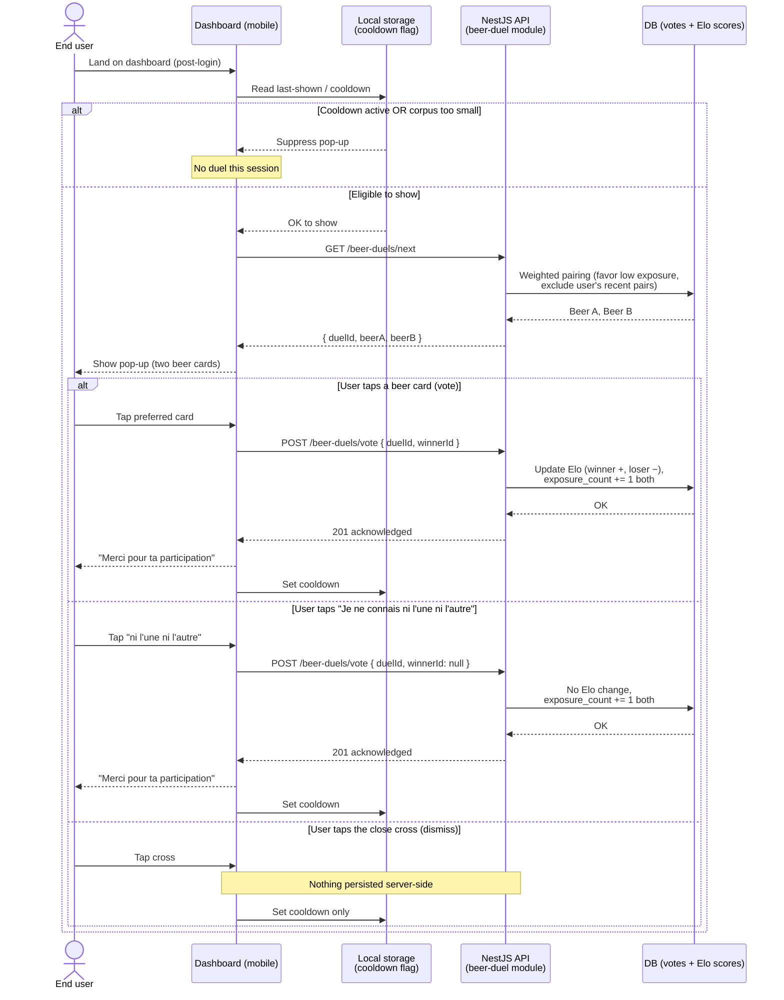

# Sequence diagram — beer-duel — login to Elo update

> **Feature**: epic `epic(beer-duel)` — community beer preference ranking via pairwise duels.
> **Source specs**: [`docs/architecture/specs/beer-duel.md`](../../specs/beer-duel.md) §3 (canonical rules).
> **Related ADRs**: [ADR-0002](../../decisions/0002-centralized-nestjs-backend.md), [ADR-0005](../../decisions/0005-backend-split-encyclopedia-vs-product.md), [ADR-0006](../../decisions/0006-beer-duel-preference-data-ownership.md).
> **Companion**: [01-use-case.md](01-use-case.md), [05-state-duel-session.md](05-state-duel-session.md).

## Context

Temporal flow from the user landing on the dashboard to the server-side Elo update. Covers the three outcomes (vote / cancelled match / dismissal). Per ADR-0002, the mobile app calls **only** the NestJS API through [`http-client.ts`](../../../packages/mobile-app/src/core/http/http-client.ts) — no direct third-party calls.

This diagram does **not** show data shapes ([04 class](04-class.md)) or the pop-up lifecycle states ([05 state](05-state-duel-session.md)).

## Diagram

## Notes

- **The dismissal path never touches the API.** Closing the pop-up is a pure client concern; only the local cooldown updates. This keeps "I'm not in the mood" out of the dataset entirely (distinct from "I know neither", which *is* a signal worth its exposure count). See [spec §1 vocabulary](../../specs/beer-duel.md#1-vocabulary).
- **Elo is computed server-side.** The client sends only `winnerId` (or `null`); the API owns the math authoritatively ([spec §3.4](../../specs/beer-duel.md#34-anti-abuse)). A client that posts a precomputed score violates this contract.
- **`GET /beer-duels/next` excludes recently-voted pairs for this user**, enforcing the per-user pair cooldown so a user cannot farm a beer's score.
- **Cooldown is set on every terminal outcome** (vote, cancelled, dismissed) — the pop-up does not re-appear until it elapses.
