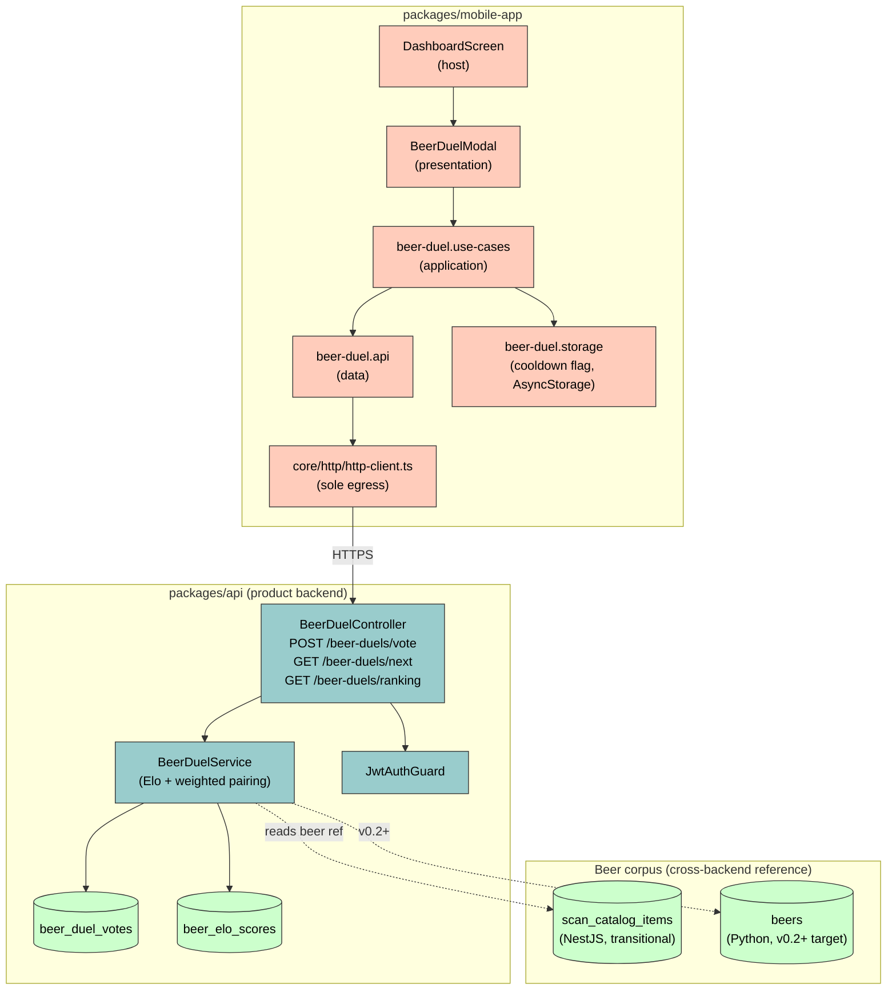

# Component diagram — beer-duel — structural decomposition

> **Feature**: epic `epic(beer-duel)` — community beer preference ranking via pairwise duels.
> **Source specs**: [`docs/architecture/specs/beer-duel.md`](../../specs/beer-duel.md) §4 (dependencies).
> **Related ADRs**: [ADR-0002](../../decisions/0002-centralized-nestjs-backend.md), [ADR-0005](../../decisions/0005-backend-split-encyclopedia-vs-product.md), [ADR-0009](../../decisions/0009-beer-duel-preference-data-ownership.md).
> **Companion**: [01-use-case.md](01-use-case.md) (the *what*; this is the *how it is structured*).

## Context

How the feature is decomposed across packages. This is the right place for the Mobile / NestJS split — the [use-case diagram](01-use-case.md) deliberately keeps it out (UML 2.5 orthodoxy). Per ADR-0009, votes and Elo scores live in the **NestJS product backend**; the beer reference is a cross-backend pointer (transitionally NestJS `scan_catalog_items`, target Python `beers`).

## Diagram

## Notes

- **Single egress point.** All API traffic goes through [`core/http/http-client.ts`](../../../packages/mobile-app/src/core/http/http-client.ts) per ADR-0002 + the root CLAUDE.md forbidden-patterns rule. The `data` layer never calls `fetch()` directly.
- **Layering.** `presentation → application → data` is enforced: the modal never imports `beer-duel.api` directly, it goes through `beer-duel.use-cases` (mirrors the `features/batches/{data,application}` pattern).
- **Votes & Elo in NestJS, not Python.** Per ADR-0009: votes carry `user_id` and the Python encyclopedia carries no user data. The aggregate ranking *could* later be promoted to the encyclopedia as a public beer fact — tracked as an ADR-0009 escape hatch, not built now.
- **Beer reference is not a hard FK.** `Service` resolves the beer reference against `scan_catalog_items` today and `beers` at v0.2+; referential integrity across the package boundary is the application's responsibility (ADR-0005), shown as a dashed dependency.
